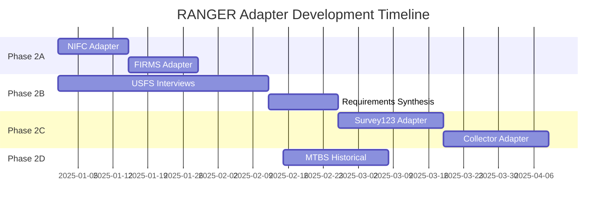

# RANGER Integration Roadmap

**Purpose:** Map the transition from Phase 1 simulated fixtures to Phase 2 live external data sources.
**Last Updated:** 2025-12-21

---

## Overview

RANGER is the **nerve center, not the sensors**. This roadmap defines how simulated Phase 1 data evolves into production integrations with existing USFS systems and public wildfire APIs.

```
Phase 1 (Current)                     Phase 2 (Future)
─────────────────                     ────────────────
Fixture JSON files        →           External APIs + Adapters
Simulated agents          →           Live Gemini reasoning
Mock sync service         →           Real data pipelines
Cedar Creek demo          →           Multi-fire operations
```

---

## Phase 1 → Phase 2 Data Source Mapping

| Domain | Phase 1 (Simulated) | Phase 2 (Live Source) | Adapter | Priority |
|--------|---------------------|----------------------|---------|----------|
| **Fire Perimeters** | `cedar-creek-geojson.json` | NIFC Open Data API | `NIFCAdapter` | P1 |
| **Burn Severity** | `burn-severity.json` | MTBS + RAVG | `MTBSAdapter` | P2 |
| **Active Fire Detection** | N/A | NASA FIRMS API | `FIRMSAdapter` | P1 |
| **Trail Damage** | `trail-damage.json` | Survey123 / Collector | `Survey123Adapter` | P2 |
| **Timber Plots** | `timber-plots.json` | FSVeg / Survey123 | `CollectorAdapter` | P3 |
| **Incident Metadata** | `briefing-events.json` | InciWeb + IRWIN | `InciWebAdapter` | P3 |

---

## Integration Phases

### Phase 1: Foundation (Current)
**Status:** ✅ Complete

- Static JSON fixtures simulate external data
- Agents use real Gemini reasoning on simulated inputs
- UI renders AgentBriefingEvents with proof layers
- Export formats (TRACS CSV, FSVeg XML) are production-ready

**Key Artifacts:**
- `data/fixtures/cedar-creek/` - Simulated input data
- `docs/architecture/FIXTURE-DATA-FORMATS.md` - Schema documentation

---

### Phase 2A: Public API Integration
**Status:** 🔄 Ready to Start
**Estimated Effort:** 2-3 weeks

**Goal:** Replace fire perimeter and active fire fixtures with live public APIs.

**Tasks:**
1. [ ] Implement `NIFCAdapter` for fire perimeters
2. [ ] Request NASA FIRMS API key
3. [ ] Implement `FIRMSAdapter` for active fire detection
4. [ ] Add data refresh polling (15-minute intervals)
5. [ ] Build adapter health dashboard

**Dependencies:**
- None (public APIs, no credentials needed for NIFC)
- FIRMS requires free API key (instant)

**Reference:** `docs/research/PUBLIC-API-INVENTORY.md`

---

### Phase 2B: USFS Interview Research
**Status:** 🔄 Ready to Start
**Estimated Effort:** 4-6 weeks

**Goal:** Understand real USFS field workflows before building integrations.

**Tasks:**
1. [ ] Schedule interviews with field personnel
2. [ ] Conduct 3-5 interviews using provided guides
3. [ ] Synthesize findings into integration requirements
4. [ ] Update adapter specifications based on feedback

**Dependencies:**
- USFS contacts (user has confirmed access)

**Reference:** `docs/research/USFS-INTERVIEW-MATERIALS.md`

---

### Phase 2C: ArcGIS Integration
**Status:** 📋 Planned
**Estimated Effort:** 4-6 weeks

**Goal:** Integrate with Survey123 and Collector for field data.

**Tasks:**
1. [ ] Obtain ArcGIS Online credentials
2. [ ] Implement `Survey123Adapter` with OAuth
3. [ ] Implement `CollectorAdapter` with OAuth
4. [ ] Set up webhook endpoints for real-time sync
5. [ ] Test offline sync scenarios

**Dependencies:**
- ArcGIS Online organization account
- USFS stakeholder approval

**Reference:** `docs/architecture/DATA-INGESTION-ADAPTERS.md`

---

### Phase 2D: Historical Data Integration
**Status:** 📋 Planned
**Estimated Effort:** 2-3 weeks

**Goal:** Add historical fire context for NEPA analysis.

**Tasks:**
1. [ ] Download MTBS national dataset
2. [ ] Filter to relevant regions (California, Oregon, Washington)
3. [ ] Build `MTBSAdapter` for historical queries
4. [ ] Integrate with NEPA Advisor for re-burn risk analysis

**Dependencies:**
- Storage for large shapefiles (Git LFS or S3)

**Reference:** `docs/research/PUBLIC-API-INVENTORY.md`

---

### Phase 3: Production Operations
**Status:** 🔮 Future
**Estimated Effort:** TBD

**Goal:** Full operational deployment with multiple active fires.

**Tasks:**
- Multi-tenant architecture for simultaneous fire operations
- SLA monitoring and alerting
- Data quality dashboards
- User access control and authentication
- Mobile field sync (Field Companion or partner apps)

**Dependencies:**
- Phase 2 completion
- Operational budget and infrastructure

---

## Adapter Development Sequence



---

## Risk Assessment

| Risk | Likelihood | Impact | Mitigation |
|------|------------|--------|------------|
| API rate limiting (FIRMS) | Medium | Low | Cache responses, respect rate limits |
| IRWIN access denied | High | Medium | Use NIFC as public alternative |
| ArcGIS credential delays | Medium | High | Use mock adapters until credentials arrive |
| Schema changes | Low | Medium | Version adapters, monitor for breaking changes |
| Interview scheduling | Medium | Low | Flexible timeline, remote options |

---

## Success Metrics

### Phase 2A Success
- [ ] NIFC adapter fetches real perimeters for 2024+ fires
- [ ] FIRMS adapter overlays active fire detections on map
- [ ] Data refreshes automatically every 15 minutes
- [ ] Adapter health endpoint reports all adapters healthy

### Phase 2B Success
- [ ] 3+ field personnel interviews completed
- [ ] 2+ IT/GIS staff interviews completed
- [ ] Requirements document synthesized
- [ ] Adapter specifications updated based on findings

### Phase 2C Success
- [ ] Survey123 trail damage submissions sync to RANGER
- [ ] Collector spatial features appear on Command Console map
- [ ] Offline sync works from mobile devices
- [ ] OAuth tokens refresh automatically

---

## Related Documents

| Document | Purpose |
|----------|---------|
| `docs/architecture/FIXTURE-DATA-FORMATS.md` | Current fixture schemas |
| `docs/architecture/DATA-INGESTION-ADAPTERS.md` | Adapter architecture |
| `docs/research/PUBLIC-API-INVENTORY.md` | API research and access |
| `docs/research/USFS-INTERVIEW-MATERIALS.md` | Stakeholder interview guides |
| `docs/DATA-SIMULATION-STRATEGY.md` | Phase 1 simulation boundaries |

---

## Next Actions

1. **Immediate:** Review this roadmap with stakeholders
2. **Week 1:** Begin NIFC adapter implementation
3. **Week 1:** Request NASA FIRMS API key
4. **Week 2:** Schedule first USFS stakeholder interview
5. **Week 3:** Complete NIFC + FIRMS adapters
6. **Week 4:** Synthesize initial interview findings

---

## Document History

| Version | Date | Changes | Author |
|---------|------|---------|--------|
| 1.0.0 | 2025-12-21 | Initial roadmap created | Claude Code |
