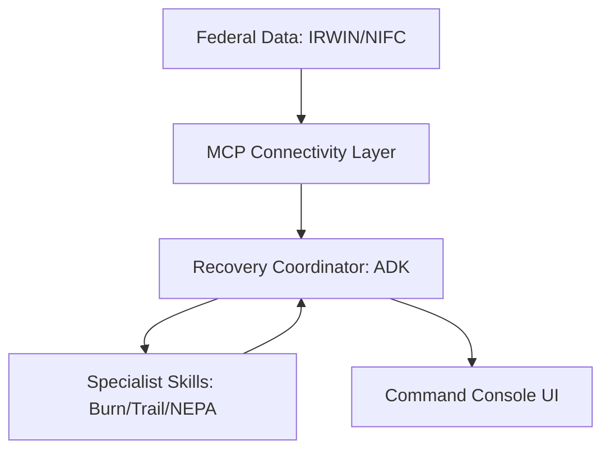

# RANGER: Product Summary
 
 > [!IMPORTANT]
 > **Architectural Source of Truth:** This document has been aligned with [ADR-005: Skills-First Architecture](file:///Users/jvalenzano/Projects/ranger-twin/docs/adr/ADR-005-skills-first-architecture.md). RANGER has moved from a FastAPI-centric microservice model to a **Skills-First paradigm** powered by the **Google ADK** and **Gemini 2.0 Flash**.
 
 **Version:** 1.0  
**Date:** December 24, 2025  
**Purpose:** A single document the product team can rally behind

---

## The One-Liner

> **RANGER is an AI-powered nerve center that coordinates post-fire forest recovery, compressing weeks of disconnected analysis into hours of unified intelligence.**

---

## What Is RANGER?

RANGER is an **Agentic Operating System for Natural Resource Recovery**. It's not a dashboard, not a GIS viewer, and not another federal IT system with AI bolted on. It's a **multi-agent coordination platform** where specialized AI agents—each expert in a domain and enhanced by portable **Skills**—talk to each other, synthesize insights, and present human decision-makers with actionable briefings.

Think of it as a **digital crew** for post-fire recovery:

| Agent | Role | Domain Expertise (Skills) |
|-------|------|--------------|
| **Burn Analyst** | Fire Impact Specialist | MTBS Classification, Soil Burn Severity, Boundary Mapping |
| **Trail Assessor** | Infrastructure Damage Expert | Damage Classification, Closure Decision, Repair Prioritization |
| **Cruising Assistant** | Timber Salvage Advisor | Cruise Methodology, Volume Estimation, Salvage Assessment |
| **NEPA Advisor** | Compliance Specialist | Pathway Decision (CE/EA/EIS), Documentation, RAG over FSM/FSH |
| **Recovery Coordinator** | Mission Commander | Delegation, Portfolio Triage, Cross-Domain Synthesis |

**The key insight:** These agents don't just answer questions—they coordinate. When the Burn Analyst finds high-severity burn in a sector, it automatically briefs the Recovery Coordinator to task the Trail Assessor with prioritizing trails in that area. The system thinks across domains the way a well-functioning team would.

---

## The Problem We're Solving

### The Current Reality

A District Ranger (Sarah) oversees Cedar Creek Fire recovery with:

- **14 separate data systems** (Sentinel-2 imagery, crew GPS, LiDAR, weather, soil surveys, budgets, scheduling, NEPA tracking...)
- **2+ hours every morning** assembling a briefing from disconnected sources
- **No integrated reasoning** — "Is this trail safe? What species should we plant? Is this NEPA compliant?" are educated guesses
- **Hidden decision chains** — Regional leadership gets 40+ slides with no reasoning transparency
- **Compliance burden** — NEPA memos take 8+ hours of attorney time per decision
- **Analysis paralysis** — By the time a decision is documented and approved, conditions have changed

### The Consequence

Nationwide, the Forest Service loses **2-5 years per major fire recovery** due to:
- Administrative bottlenecks
- Siloed expertise that can't coordinate
- Manual data synthesis that's too slow to keep up with conditions
- Compliance overhead that delays action

**Cedar Creek (127,000 acres, 2022):** Still recovering. Trails closed. Timber decaying. Erosion accelerating. Reforestation behind schedule. Not because the Forest Service lacks expertise—because the expertise is trapped in disconnected systems and manual processes.

---

## The Solution: Coordinated AI Intelligence

### Before RANGER

```
6:00 AM  — Ranger starts assembling briefing from 14 systems
8:00 AM  — Briefing ready (2+ hours, incomplete)
9:00 AM  — Meeting with team, discussing what data is missing
11:00 AM — Trail crew goes out, discovers conditions have changed
2:00 PM  — Timber sale decision delayed waiting for NEPA review
5:00 PM  — Ranger realizes erosion risk was missed in morning briefing
```

### After RANGER

```
6:15 AM  — Recovery Coordinator runs automatically
6:17 AM  — Ranger sees unified briefing ready:
           🔴 CRITICAL: High-severity burn zone expanding erosion risk
           🟡 HIGH: Trail crew should reroute—debris flow detected
           🟢 COMPLIANT: Timber salvage pre-cleared, NEPA memo drafted
6:20 AM  — Ranger reviews AI reasoning, approves actions
6:30 AM  — Teams deploy with coordinated intelligence
```

**Decision latency:** 2 hours → 5 minutes (24x faster)  
**Decision quality:** Guess → Integrated analysis  
**Compliance time:** 8 hours → 1 hour (with citations)  
**Risk visibility:** Manual → Systematic

---

## Key Features

### 1. Multi-Agent Orchestration

The Recovery Coordinator doesn't just route queries—it **understands dependencies** between agents and **synthesizes cross-domain insights**:

```
User: "Give me a recovery briefing for Cedar Creek"

Recovery Coordinator:
├── Tasks Burn Analyst: "Assess current severity status"
├── Tasks Trail Assessor: "Identify priority repairs"  
├── Tasks Cruising Assistant: "Evaluate salvage opportunities"
└── Tasks NEPA Advisor: "Pre-screen compliance requirements"

Result: Unified briefing showing how burn severity affects trail priorities,
        which affects timber access, which triggers specific NEPA pathways.
```

### 2. Reasoning Transparency

Every AI output includes:
- **Confidence score** (0-100%) based on data quality
- **Source citations** (exact satellite date, regulation section, field assessment)
- **Reasoning chain** (expandable logic showing how conclusion was reached)

**Example:**
```
Burn Analyst Assessment:
"Sector NW-4 shows 42% high-severity burn (18,340 acres)"

Confidence: 94%
Sources: 
- MTBS classification data (2022-09-15)
- Sentinel-2 imagery (2022-09-12)

Reasoning:
1. Retrieved fire perimeter from MTBS
2. Calculated zonal statistics for dNBR values
3. Classified using standard USFS thresholds
4. Cross-referenced with pre-fire vegetation index
```

### 3. Legacy System Compatibility

RANGER doesn't replace existing USFS systems—it **wraps them**:

| Agent | Output Format | Target System |
|-------|---------------|---------------|
| Trail Assessor | TRACS CSV | Trail Condition Assessment System |
| Cruising Assistant | FSVeg XML | Field Sampled Vegetation database |
| NEPA Advisor | EA/CE templates | ePlanning / SOPA |

Field staff can import RANGER outputs into their existing workflows without retraining or system changes.

### 4. Mission Control (Portfolio View)

For Forest Supervisors managing 30-50 fire recovery incidents:

- **Map view:** All fires at a glance with severity-coded markers
- **Triage list:** Fires ranked by urgency (severity × size × phase)
- **Filter by phase:** Active → In BAER → In Recovery
- **Drill down:** Click any fire to enter detailed tactical view

**Core principle:** "What needs my attention next?"

### 5. Tactical Futurism Design

The interface follows an **"F-35 Cockpit meets National Geographic"** aesthetic:

- **Dark mode by default** — Reduces eye strain in command centers and field conditions
- **Glassmorphism** — Translucent panels with backdrop blur
- **Status colors** — Green (#10B981) / Amber (#F59E0B) / Red (#EF4444)
- **Data-dense** — Information-rich displays for operators, not decorative dashboards

---

## Why Now?

### 1. AI Capabilities Have Matured

**Gemini 2.0 Flash** (December 2024) represents a step-change in reasoning quality:
- 78% SWE-bench (software engineering benchmark)
- 3x faster than previous generation
- Native multi-modal understanding (text + imagery + documents)
- Production-ready via Vertex AI (FedRAMP High authorized)

For the first time, AI can reliably reason across multiple domains and synthesize coherent briefings—not just answer simple questions.

### 2. The Data Is Finally Accessible

| Data Source | Status | Access Method |
|-------------|--------|---------------|
| NIFC fire perimeters | ✅ Public | REST API (no auth) |
| NASA FIRMS hotspots | ✅ Public | Free API key |
| MTBS burn severity | ✅ Public | Direct download |
| Sentinel-2 imagery | ✅ Public | Google Earth Engine |
| FSM/FSH regulations | ✅ Public | PDF corpus for RAG |

The raw data exists. No one has built the **orchestration layer** to make it useful.

### 3. Federal AI Mandate

The **USDA AI Strategy (FY 2025-2026)** explicitly prioritizes:
- AI-assisted decision support for resource management
- Natural language interfaces for domain experts
- Transparency and auditability in AI recommendations

RANGER aligns perfectly with the mandate. The question isn't "should we build this?" but "how fast can we demonstrate value?"

### 4. Fire Recovery Is Getting Harder

- **Larger fires:** 7 of the 10 largest fires in California history occurred since 2020
- **Longer seasons:** Fire season now extends May-November (vs. June-September historically)
- **More complexity:** Climate change means historical baselines are less predictive
- **Same staffing:** Forest Service budgets haven't scaled with fire complexity

**The math doesn't work anymore.** Human-only recovery planning can't keep pace with the scale and speed of modern fire impacts.

---

## What Differentiates RANGER?

### vs. Existing USFS Systems (RAVG, TRACS, FScruiser)

| Capability | Legacy Systems | RANGER |
|------------|----------------|--------|
| Integration | Siloed by domain | Unified platform |
| Interface | GIS expertise required | Natural language |
| Reasoning | Data retrieval only | AI synthesis |
| Compliance | Manual cross-reference | Automated citations |
| Speed | Days to weeks | Hours |

**We don't replace these systems—we make them talk to each other.**

### vs. Commercial Platforms (Esri, Palantir)

| Dimension | Commercial | RANGER |
|-----------|------------|--------|
| Licensing | $100K-$1M+/year | $0 (open source) |
| Lock-in | Proprietary formats | Open standards |
| Customization | Expensive services | Agent-first design |
| Federal readiness | Varies | FedRAMP High from day one |
| Focus | General-purpose | Forest recovery specific |

**80% of budget goes to AI capabilities, 20% to application shell.** Commercial platforms invert this ratio.

### vs. Research Projects (Academic, NASA)

| Dimension | Research | RANGER |
|-----------|----------|--------|
| Deployment | Prototype/POC | Production-ready |
| Users | Researchers | Operators |
| Compliance | Not addressed | NEPA integrated |
| Legacy systems | Ignored | Export compatible |
| Sustainability | Grant-dependent | Operational budget |

**We're building for District Rangers, not PhDs.**

---

## The Technical Foundation

### Architecture



*For detailed state transitions and sequence diagrams, see **[AGENT-FLOWS.md](./architecture/AGENT-FLOWS.md)**.*

### Key Design Decisions

| Decision | Choice | Rationale |
|----------|--------|-----------|
| Agent framework | Google ADK | FedRAMP authorized, shared session state |
| Data Connectivity | MCP Servers | Decentralized, standard protocol for federal APIs |
| Agent pattern | Skills-First | Expertise encapsulated in portable skills (ADR-005) |
| Frontend | React + Tailwind | Modern, responsive tactical UI |
| Database | PostGIS + pgvector | Spatial index + high-dimensional RAG storage |
| Cloud | GCP | FedRAMP High, Vertex AI integration |

### Cost Profile

| Period | Monthly Cost | Notes |
|--------|-------------|-------|
| Fire season (May-Oct) | $800-1,200 | Active usage |
| Off-season (Nov-Apr) | $100-200 | Scale-to-zero |
| **Annual estimate** | **$6,000-9,000** | Compare: Esri $100K+, Palantir $1M+ |

---

## Phase 1: The Demo

### What We're Building (6 weeks)

A **fully functional demonstration** using Cedar Creek Fire (2022) as our proof-of-concept:

- **Real location, real fire, real data** (historical, publicly available)
- **Real AI reasoning** (Gemini 2.0 Flash via Vertex AI)
- **Simulated upstream data** (static fixtures representing what real APIs would return)

### What We're Proving

| We ARE Proving | We Are NOT Proving |
|----------------|-------------------|
| Multi-agent coordination works | We can process satellite imagery |
| Reasoning transparency builds trust | We can detect trail damage from video |
| Cross-domain synthesis creates value | We can run CV models at the edge |
| Legacy export compatibility | We can build offline mobile apps |
| The UX is compelling | We can replace human expertise |

### Success Criteria

- [ ] Cross-agent cascade completes with correlation tracking
- [ ] Reasoning chains are visible and expandable
- [ ] FSM/FSH citations link to actual sources
- [ ] TRACS CSV and FSVeg XML exports validate
- [ ] Demo runs in < 30 seconds end-to-end
- [ ] Stakeholder reaction: "Holy shit, this actually works"

---

## Current Focus: Mission Control UX

We're implementing the **portfolio triage interface** that lets Forest Supervisors manage 30-50 fire recovery incidents. This view must support a very specific workflow:

### The 8-Minute Reality

Regional Forester Maria has 8 minutes before her 6:40 AM briefing call with Washington. She needs to answer:

1. **"What's going sideways?"** — Which 3-5 fires need escalation in the next 72 hours?
2. **"Where's the resource pressure?"** — Are any districts getting overwhelmed?
3. **"What do I tell Washington?"** — A 30-second summary of regional recovery posture

The current screen fails Maria on all three questions. She sees 2 fires when she manages 47, has no explanation for triage scores, and no summary view for her briefing.

### Tier 1 (This Sprint) — Trust Repair

These aren't features—they're **table stakes for adoption**:

| Priority | Change | Why It Matters |
|----------|--------|----------------|
| **P0** | "Showing X of Y fires" + filter chips | Prevents "where did my data go?" panic that kills trust |
| **P0** | Triage score explainability (hover) | Unexplained scores get ignored; staff revert to gut feel |
| **P1** | Map markers match card severity badges | Visual inconsistency erodes confidence in the system |
| **P1** | Kill season slider → operational filters | The slider answers a question no supervisor asks |

### Tier 2 (Next Sprint) — Decision Support

Once trust is established, accelerate Maria's workflow:

| Priority | Change | Why It Matters |
|----------|--------|----------------|
| **P1** | Portfolio summary bar | "47 fires · 4 Critical · 12 High" enables 30-second briefing |
| **P1** | "Changed in 24h" indicators | The delta from yesterday is the most important information |
| **P2** | Collapse left rail → header dropdown | Recover 72px for map; critical for tablets in the field |
| **P2** | Bidirectional map-list sync | Click marker → highlight card eliminates cognitive translation |

### Tier 3 (Future) — AI-Driven Operations

The Recovery Coordinator should work for Maria, not wait for her to ask:

| Priority | Change | Why It Matters |
|----------|--------|----------------|
| **P2** | Auto-generated overnight summary | "3 incidents changed status. Bootleg: new erosion risk..." |
| **P3** | Natural language portfolio queries | "Show critical R6 fires entering BAER this week" |
| **P3** | Proactive anomaly detection | "Bootleg trending worse despite 100% containment" |

**Core principle:** Fix trust first. Then add AI magic. In that order.

## The Operational Reality

*This section captures insights from stress-testing RANGER against real USFS workflows.*

### Who Actually Uses This

| User | Context | Time Budget | Primary Question |
|------|---------|-------------|------------------|
| **Forest Supervisor** | 6:30 AM briefing prep | 8 minutes | "What's going sideways in my forest?" |
| **Regional Coordinator** | Multi-forest oversight | 15 minutes | "Where's my risk concentrated?" |
| **District Ranger** | Tactical decisions | 30+ minutes | "What do my crews need to know today?" |
| **Field Crew Lead** | On-site, often offline | 2 minutes | "Is this area safe to work?" |

### The Questions That Matter

A supervisor at 6:30 AM doesn't ask "show me a map." They ask:

1. **"Which 3-5 fires need my attention in the next 72 hours?"**
2. **"What changed overnight?"** — The delta is more important than current state
3. **"Are any incidents trending worse despite high containment?"**
4. **"What do I tell Washington?"** — A 30-second executive summary
5. **"Where are my crews exposed?"** — Safety trumps everything

### What Kills Adoption

After 20 years of shipping tools into real forests, these are the trust-killers:

| Issue | Impact | How We Prevent It |
|-------|--------|-------------------|
| **Unexplained AI scores** | Staff ignore them, revert to gut feel | Hover tooltips showing score breakdown |
| **Missing data without explanation** | "System is broken" → close tab → use paper | "Showing X of Y fires" always visible |
| **Visual inconsistency** | "Which color is correct?" → trust erodes | Map markers match card severity badges |
| **Answering wrong questions** | Season slider no one asked for | Operational filters: "Entering BAER this week" |
| **No offline resilience** | Field staff can't use it where they need it | Cache last-synced state, show staleness |

### Real Workflow Scenarios

**Scenario 1: Morning Briefing (6:30 AM)**
- Supervisor has 8 minutes before Washington call
- Needs: Portfolio summary, overnight changes, top 3 risks
- Failure mode: Spends 5 minutes manually counting fires → misses briefing prep

**Scenario 2: Incident Escalation (Mid-day)**
- BAER team reports unexpected erosion risk
- Needs: Immediate visibility, resource reallocation options
- Failure mode: Change buried in a list → not surfaced until next day

**Scenario 3: End of Week Planning (Friday PM)**
- Planning next week's crew deployments
- Needs: Salvage windows closing, BAER deadlines, equipment availability
- Failure mode: No temporal view → crews deployed to wrong priorities

**Scenario 4: Field Tablet (Low Connectivity)**
- Crew lead checking assignment details at trailhead
- Needs: Cached data, clear safety alerts, offline maps
- Failure mode: Spinner → no data → paper backup (defeats purpose)

### What "Nerve Center" Actually Means

The difference between a dashboard and a nerve center:

| Dashboard | Nerve Center |
|-----------|--------------|
| Shows current state | Surfaces changes and anomalies |
| Waits for queries | Proactively alerts |
| Requires user to synthesize | Provides integrated briefings |
| Same view for everyone | Adapts to user role and context |
| Pretty visualizations | Decision-ready information |

RANGER must be a nerve center. The Recovery Coordinator should work for Maria—generating overnight summaries, flagging anomalies, pre-staging briefing content—not wait for her to ask.

---

## Operational Stress Test: What We Learned

The Mission Control screen was evaluated against real USFS workflows by a 20-year veteran of shipping tools into forests. Key findings:

### What's Working
- **Dark mode aesthetic** — Appropriate for 5 AM IOF (Incident Operations Facility) use
- **Map-list pairing** — Supervisors think both spatially and by priority
- **Phase filter concept** — Active → In BAER → In Recovery matches actual lifecycle
- **UTC timestamp** — Fire operations run on Zulu time; signals this is a serious tool
- **"Enter →" CTA** — Unambiguous action, no guessing

### What's Broken (And Why It Matters)

| Issue | Current State | Operational Impact |
|-------|---------------|-------------------|
| **"Where did my fires go?"** | 2 fires shown when 47 expected | Supervisor loses trust, closes tab, uses paper |
| **Triage score black box** | "165.5" with no explanation | Scores get ignored, staff revert to gut feel |
| **Season slider confusion** | Draggable timeline May-Oct | Accidentally lose portfolio, 5 min to recover |
| **No change indicators** | Static cards, no deltas | Most important info (overnight changes) invisible |
| **No summary view** | Just map + list | Can't answer "what do I tell Washington?" |
| **Visual inconsistency** | Map colors ≠ card badges | "Which is correct?" erodes confidence |
| **FIRMS button on recovery view** | Active fire tool on recovery screen | Wrong context, confusing |

### The Trust Hierarchy

Based on field deployment experience, adoption follows this pattern:

```
Trust in Data → Trust in AI → Trust in Recommendations → Behavior Change
```

If users don't trust the basic data display (filtered counts, visual consistency), they'll never trust AI recommendations. **Fix trust first. Add magic second.**

---

## The Team & Timeline

**Team:** jvalenzano - Digital Twin Initiative  
**Size:** 3 developers  
**Timeline:** January 6 - February 14, 2026 (6 weeks)  
**Target:** USFS regional office demonstration

### Milestones

| Week | Milestone | Deliverable |
|------|-----------|-------------|
| 1-2 | Foundation | Living map, fire story overlay, tour framework |
| 3-4 | Intelligence | Agent orchestration, Gemini integration, chat |
| 5-6 | Polish | Mission Control UX, performance, demo script |

---

## The Pitch (30 Seconds)

> "RANGER is the Forest Service's first integrated digital twin for post-fire recovery. It connects burn severity, trail damage, timber inventory, and NEPA compliance through a unified AI platform. Built entirely on open source tools with no licensing fees, it delivers analysis in hours that currently takes weeks. We're demonstrating with Cedar Creek Fire data—click 'Run Demo' and watch the Recovery Coordinator orchestrate four AI agents into a coordinated briefing."

---

## Taglines

| Audience | Tagline |
|----------|---------|
| **Primary** | "Recovery at the speed of insight." |
| **Leadership** | "AI-powered decisions for forest recovery." |
| **Field Staff** | "Your digital crew for post-fire recovery." |
| **Technical** | "Agent-first. Open source. Federal-ready." |
| **Budget** | "Zero licensing. Maximum intelligence." |

---

## What We Need From the Team

1. **Believe in coordination over features** — The magic is agents talking to each other, not individual capabilities
2. **Protect the 80/20 split** — AI investment first, UI polish second
3. **Keep it federal-ready** — FedRAMP, accessibility, audit trails from day one
4. **Demo-driven development** — If it doesn't show well, it doesn't matter
5. **Human-in-the-loop always** — AI recommends, humans decide
6. **Fix trust before adding magic** — Unexplained data kills adoption faster than missing features
7. **Design for the 8-minute reality** — Every screen must answer "what needs my attention next?"

---

## References

| Document | Purpose |
|----------|---------|
| [PROJECT-BRIEF.md](./PROJECT-BRIEF.md) | Master vision document |
| [BRAND-ARCHITECTURE.md](./brand/BRAND-ARCHITECTURE.md) | Naming conventions |
| [AGENTIC-ARCHITECTURE.md](./architecture/AGENTIC-ARCHITECTURE.md) | Technical architecture |
| [_MISSION-CONTROL.md](./features/_MISSION-CONTROL.md) | Current implementation plan |
| [DATA-SIMULATION-STRATEGY.md](./DATA-SIMULATION-STRATEGY.md) | Phase 1 simulation boundaries |
| [STAKEHOLDER-MESSAGING.md](./brand/STAKEHOLDER-MESSAGING.md) | Audience-specific messaging |
| [ADR-009: Fixture-First Development](./adr/ADR-009-fixture-first-development.md) | Demo vs. production architecture |
| [DEMO-DATA-REFERENCE.md](./DEMO-DATA-REFERENCE.md) | Quick reference for stakeholder conversations |

---

**Document Owner:** RANGER Product Team  
**Last Updated:** December 27, 2025  
**Status:** Living document — update as we learn
