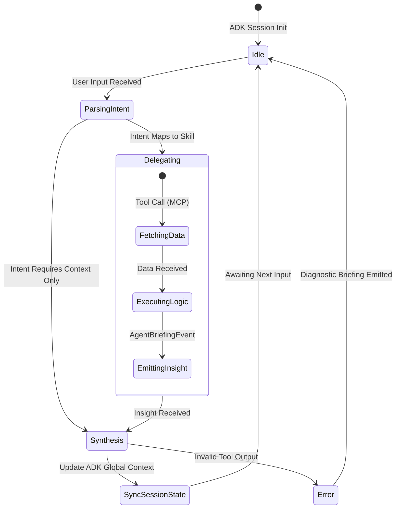
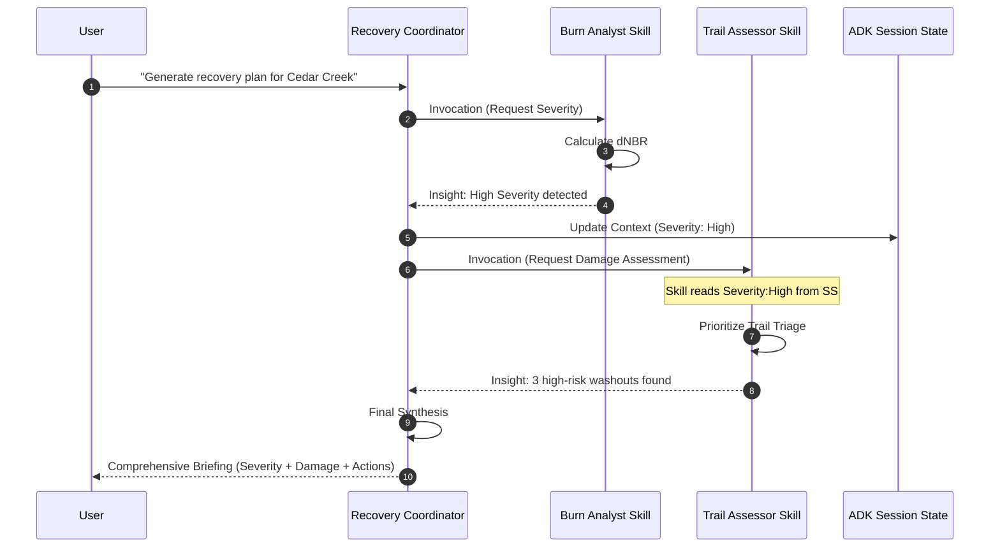
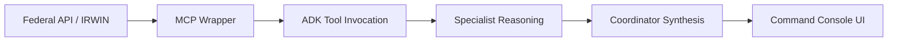

# RANGER Agent Flow Visualizations

> [!IMPORTANT]
> **Standard:** These diagrams represent the authoritative logic flows for the **[ADR-005](../adr/ADR-005-skills-first-architecture.md)** Skills-First architecture.

## 1. ADK Local State Transitions

This diagram details how the **Recovery Coordinator** manages the local context of a fire incident as different specialist skills are invoked.

## 2. Multi-Agent Delegation Sequence

This sequence shows a typical "BAER Triage" request where the Coordinator must orchestrate multiple skills to provide a synthesized recovery plan.

## 3. Data Flow: Sensor to Insight

---
*Created: December 2025*
