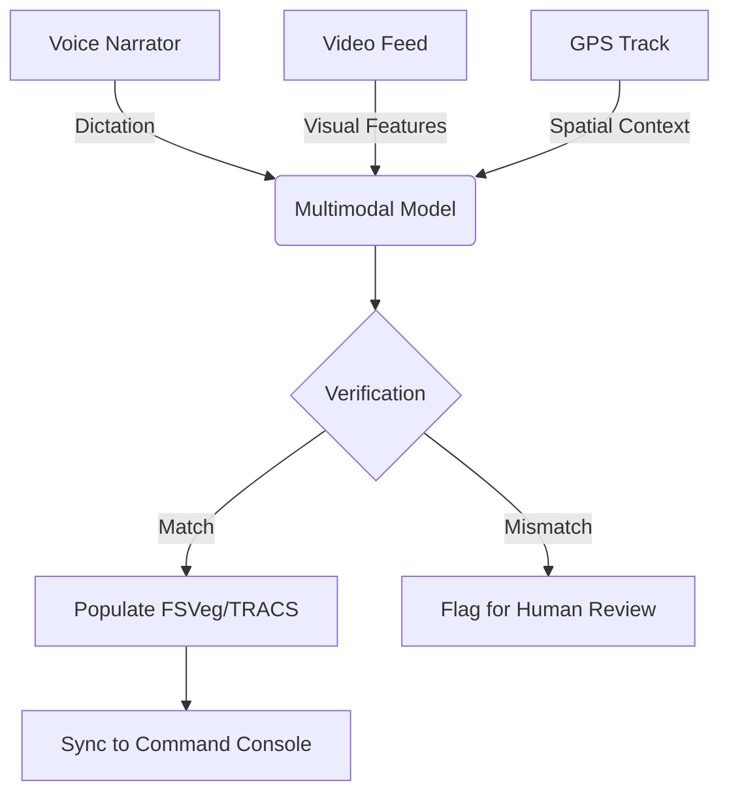

While the RANGER Command Console provides the "Strategic View" (Nerve Center), the Field AI applications serve as the "Sensory Layer." These applications harness modern multimodal AI to automate data capture in the most challenging environments on Earth.

> [!NOTE]
> **Skills-First Alignment:** In accordance with [ADR-005](../adr/ADR-005-skills-first-architecture.md), field-specific logic is encapsulated as **Application Skills** (Tier 3), enabling identical reasoning logic to be shared between field PWAs and the Command Console.

### The Core Inversion
Traditional field apps are **Data Entry Forms**.
RANGER field apps are **Observational Assistants**.

| Feature | Legacy Apps (e.g., FScruiser, TRACS) | RANGER Field AI |
|---------|------------------------------------|-----------------|
| **Interaction** | Manual tapping, typing, dropdowns | Natural language narration + video |
| **Data Source** | Human-transcribed measurements | Raw multimodal streams (Video/Audio/GPS) |
| **Processing** | Immediate validation only | Multimodal fusion (Is what they said what I see?) |
| **Connectivity** | Synchronous/Online-required | Offline-First (Sync-when-connected) |
| **AI Role** | None | Real-time species ID, damage detection, and form-filling |

---

## 2. Technical Architecture: "The Multimodal Pipeline"

To harness AI in the field, the application must manage three primary data streams simultaneously:

### A. The Data Streams
1.  **Spatial (GPS/IMU):** High-frequency location tracking and device orientation (Compass/Gyro).
2.  **Visual (Video/Photo):** 10-bit HDR video for feature extraction (bark texture, erosion depth).
3.  **Auditory (Voice):** Ambient narration describing observations (Whisper-compatible).

### B. The Multimodal Fusion Logic
The power of RANGER Field AI comes from **cross-modal verification**:

*Example: If a forester says "Large Douglas Fir with high mortality," the AI verifies the species ID and mortality percentage from the video feed and tags the exact coordinates.*

---

## 3. Key Functional Requirements

### 3.1 Offline-First "Store and Forward"
Field work happens in "Green Zones" with zero connectivity.
- **Local SQLite/Dexie:** Caches structured observations.
- **Local File System:** Buffers video/audio files until Wi-Fi/LTE is restored.
- **Conflict Resolution:** Last-write-wins with manual override for field observations.

### 3.2 Edge vs. Cloud AI
- **Edge (Mobile Device):** Basic object detection (bounding boxes), voice-to-text preview, and GPS fusion.
- **Cloud (GCP/Vertex AI):** High-fidelity multimodal analysis (Gemini 2.0 Pro), detailed species classification, and legacy system export (TRACS/FSVeg).

### 3.3 "Tactical UI" for the Field
- **One-Handed Mastery:** All primary controls accessible via thumb.
- **Voice-First Interaction:** Hands-free data marking using trigger words (e.g., "Mark Bridge Failure").
- **Haptic Feedback:** Vibrations confirm successful AI identification without needing to look at the screen.

---

## 4. Agent Roles in the Field

| Agent | Field Capability (Future) | Output |
|-------|--------------------------|--------|
| **Trail Assessor** | AR-assisted damage marking; real-time cost estimation during walk. | TRACS Work Order |
| **Cruising Assistant** | "Speak-and-See" species ID; virtual plot boundary estimation. | FSVeg Plot Record |
| **Burn Analyst** | Ground-truth verification of satellite severity predictions via camera. | Severity Validation |

---

## 5. Integration: Third-Party vs. RANGER Native

RANGER is designed to be **Platform Agnostic**. We can ingest data from:
1.  **RANGER Field Companion:** Our purpose-built multimodal PWA.
2.  **Partner Apps:** Integrations with existing tools like Avenza Maps, ArcGIS Field Maps, or Gaia GPS via standardized API endpoints.
3.  **Consumer Devices:** Direct ingestion of GoPro footage or iPhone spatial video.

---

## 6. Document History

| Version | Date | Changes |
|---------|------|---------|
| 1.0 | 2025-12-20 | Initial Strategy Document |
| 1.1 | 2025-12-25 | Aligned with ADR-005 Skills-First Architecture |
