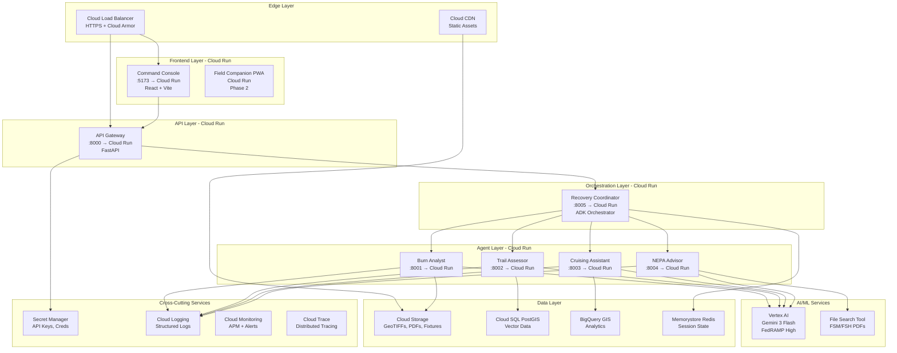

# RANGER Production Deployment Architecture (GCP)
## From Local Docker Containers to Cloud-Native Services

**Author:** RANGER Team  
**Date:** 2025-12-22  
**Audience:** Developers transitioning from local development to GCP deployment  
**Status:** Phase 2 Planning Document

---

## Document Scope

> [!NOTE]
> **This Document Covers:** Deploying the **agentic application layer** (Command Console, API Gateway, Recovery Coordinator, and 4 specialist agents) to Google Cloud Platform.
>
> **Related Documents:**
> - [ADR-005: Skills-First Architecture](../adr/ADR-005-skills-first-architecture.md) - Strategic decision for multi-agent hybrid model
> - [IMPLEMENTATION-ROADMAP.md](../IMPLEMENTATION-ROADMAP.md) - 13-week phased plan to MVP
> - [GCP-ARCHITECTURE.md](GCP-ARCHITECTURE.md) - Geospatial data processing infrastructure
> - [DATA-INGESTION-ADAPTERS.md](DATA-INGESTION-ADAPTERS.md) - Phase 2 data ingestion patterns for external systems (InciWeb, IRWIN, Survey123, ArcGIS Collector)
> - [AGENTIC-ARCHITECTURE.md](AGENTIC-ARCHITECTURE.md) - Multi-agent orchestration design and ADK patterns
>
> This document focuses on **deploying the 7 Cloud Run services** that comprise RANGER's agent runtime, not the broader geospatial data platform.

---

## Executive Summary

This document maps the **Local Developer Stack** to **Google Cloud Platform (GCP)** production deployment architecture. As a developer familiar with the local Docker environment (`localhost:5173`, `:8000-8005`), you'll learn:

1. **Infrastructure Mapping**: Which GCP services replace your local containers
2. **Cost Analysis**: Expected monthly costs for seasonal fire recovery workloads
3. **Deployment Strategy**: Cloud Run, Vertex AI, and FedRAMP compliance patterns
4. **Networking & Security**: VPC, load balancers, IAM, and data residency
5. **Scaling Strategy**: Auto-scaling, scale-to-zero, and high availability

> [!IMPORTANT]
> RANGER's architecture is designed for **serverless-first** deployment using Cloud Run. This enables **80-96% cost reduction** vs. dedicated servers for seasonal workloads (May-Oct active, Nov-Apr dormant).

---

## Local → Cloud Mapping

### Quick Reference Table

| Local Component | Port | Cloud Service | Configuration | Monthly Cost |
|-----------------|------|---------------|---------------|--------------|
| **Command Console** | 5173 | Cloud Run | 1 vCPU, 2GB RAM, min:0 | $10-30 |
| **API Gateway** | 8000 | Cloud Run | 2 vCPU, 4GB RAM, min:1 | $30-60 |
| **Recovery Coordinator** | 8005 | Cloud Run | 2 vCPU, 4GB RAM, min:0 | $20-50 |
| **Burn Analyst** | 8001 | Cloud Run | 2 vCPU, 4GB RAM, min:0 | $10-30 |
| **Trail Assessor** | 8002 | Cloud Run | 2 vCPU, 4GB RAM, min:0 | $10-30 |
| **Cruising Assistant** | 8003 | Cloud Run | 2 vCPU, 4GB RAM, min:0 | $10-30 |
| **NEPA Advisor** | 8004 | Cloud Run | 2 vCPU, 4GB RAM, min:0 | $10-30 |
| **Redis (Session State)** | 6379 | Memorystore | Basic tier, 1GB | $40 |
| **PostgreSQL (Future)** | 5432 | Cloud SQL | db-custom-2-7680 | $80 |
| **Fixture Data** | Local FS | Cloud Storage | Standard tier | $2-20 |
| **Gemini API** | Remote | Vertex AI | Gemini 3 Flash | $10-50 |

**Total Estimated Cost (Active Season):** ~**$250-450/month**  
**Total Estimated Cost (Off-Season):** ~**$50-100/month** (storage + minimal Cloud SQL)

---

## Architecture Diagram: GCP Production Stack



---

## Detailed Component Breakdown

### 1. Frontend Layer: Command Console

#### Local Development
```bash
cd apps/command-console && pnpm dev
# Runs on localhost:5173 (Vite dev server)
```

#### Cloud Deployment

**Service:** Cloud Run  
**Region:** `us-east4` (Virginia, FedRAMP High)  
**Container:** `gcr.io/ranger-twin/command-console:latest`

**Configuration:**
```yaml
apiVersion: serving.knative.dev/v1
kind: Service
metadata:
  name: command-console
spec:
  template:
    spec:
      containers:
      - image: gcr.io/ranger-twin/command-console:latest
        ports:
        - containerPort: 3000  # Production build serves on 3000
        resources:
          limits:
            cpu: 1
            memory: 2Gi
        env:
        - name: VITE_API_GATEWAY_URL
          value: https://api.ranger.usda.gov
        - name: NODE_ENV
          value: production
      scaling:
        minScale: 0  # Scale to zero when idle
        maxScale: 10
```

**Build Command:**
```bash
# Build optimized production bundle
cd apps/command-console
pnpm build

# Create Docker image
docker build -t gcr.io/ranger-twin/command-console:latest .
docker push gcr.io/ranger-twin/command-console:latest

# Deploy to Cloud Run
gcloud run deploy command-console \
  --image gcr.io/ranger-twin/command-console:latest \
  --region us-east4 \
  --platform managed \
  --allow-unauthenticated \
  --min-instances 0 \
  --max-instances 10
```

**Cost Breakdown:**
- **CPU:** 1 vCPU × $0.00002400/vCPU-second × 3600s/hr × 100 hrs/month = **$8.64**
- **Memory:** 2GB × $0.00000250/GiB-second × 3600s/hr × 100 hrs/month = **$1.80**
- **Requests:** 50,000 requests/month × $0.40/million = **$0.02**
- **Total:** ~**$10-30/month** (varies with traffic)

**Static Assets:** Serve from Cloud CDN + Cloud Storage for faster page loads and lower Cloud Run egress costs.

---

### 2. API Gateway Layer

#### Local Development
```bash
cd services/api-gateway && uvicorn app.main:app --reload
# Runs on localhost:8000
```

#### Cloud Deployment

**Service:** Cloud Run  
**Container:** `gcr.io/ranger-twin/api-gateway:latest`

**Configuration:**
```yaml
apiVersion: serving.knative.dev/v1
kind: Service
metadata:
  name: api-gateway
spec:
  template:
    spec:
      containers:
      - image: gcr.io/ranger-twin/api-gateway:latest
        ports:
        - containerPort: 8000
        resources:
          limits:
            cpu: 2
            memory: 4Gi
        env:
        - name: RECOVERY_COORDINATOR_URL
          value: https://recovery-coordinator-[hash]-uc.a.run.app
        - name: REDIS_HOST
          valueFrom:
            secretKeyRef:
              name: redis-connection
              key: host
        - name: GOOGLE_CLOUD_PROJECT
          value: ranger-twin-prod
      scaling:
        minScale: 1  # Keep warm for low latency
        maxScale: 50
```

**Deployment:**
```bash
gcloud run deploy api-gateway \
  --image gcr.io/ranger-twin/api-gateway:latest \
  --region us-east4 \
  --min-instances 1 \
  --max-instances 50 \
  --set-secrets REDIS_HOST=redis-connection:latest
```

**Cost:** ~**$30-60/month** (always-on min instance + burst capacity)

**Why `minScale: 1`?**  
The API Gateway is user-facing and requires low latency. Keeping 1 instance warm eliminates cold starts (~1-2 seconds) for the first request.

---

### 3. Orchestration Layer: Recovery Coordinator

#### Local Development
```bash
cd services/agents/recovery-coordinator && python -m recovery_coordinator.main
# Runs on localhost:8005
```

#### Cloud Deployment

**Service:** Cloud Run  
**Container:** `gcr.io/ranger-twin/recovery-coordinator:latest`

**Configuration:**
```yaml
apiVersion: serving.knative.dev/v1
kind: Service
metadata:
  name: recovery-coordinator
spec:
  template:
    spec:
      containers:
      - image: gcr.io/ranger-twin/recovery-coordinator:latest
        ports:
        - containerPort: 8005
        resources:
          limits:
            cpu: 2
            memory: 4Gi
        env:
        - name: VERTEX_AI_PROJECT
          value: ranger-twin-prod
        - name: VERTEX_AI_LOCATION
          value: us-east4
        - name: MODEL_NAME
          value: gemini-3-flash
        - name: BURN_ANALYST_URL
          value: https://burn-analyst-[hash]-uc.a.run.app
        - name: TRAIL_ASSESSOR_URL
          value: https://trail-assessor-[hash]-uc.a.run.app
        - name: CRUISING_ASSISTANT_URL
          value: https://cruising-assistant-[hash]-uc.a.run.app
        - name: NEPA_ADVISOR_URL
          value: https://nepa-advisor-[hash]-uc.a.run.app
      serviceAccountName: recovery-coordinator-sa@ranger-twin-prod.iam.gserviceaccount.com
      scaling:
        minScale: 0
        maxScale: 20
```

**IAM Permissions (Service Account):**
```bash
# Grant Vertex AI access
gcloud projects add-iam-policy-binding ranger-twin-prod \
  --member="serviceAccount:recovery-coordinator-sa@ranger-twin-prod.iam.gserviceaccount.com" \
  --role="roles/aiplatform.user"

# Grant Cloud Run invoker for agent services
gcloud run services add-iam-policy-binding burn-analyst \
  --member="serviceAccount:recovery-coordinator-sa@ranger-twin-prod.iam.gserviceaccount.com" \
  --role="roles/run.invoker" \
  --region us-east4
```

**Cost:** ~**$20-50/month** (bursty traffic, scales to zero)

---

### 4. Specialist Agent Services

#### Local Development
```bash
cd services/agents/burn-analyst && python -m burn_analyst.main  # :8001
cd services/agents/trail-assessor && python -m trail_assessor.main  # :8002
cd services/agents/cruising-assistant && python -m cruising_assistant.main  # :8003
cd services/agents/nepa-advisor && python -m nepa_advisor.main  # :8004
```

#### Cloud Deployment

Each agent deploys as an **independent Cloud Run service** with identical configuration patterns:

**Example: Burn Analyst**
```yaml
apiVersion: serving.knative.dev/v1
kind: Service
metadata:
  name: burn-analyst
spec:
  template:
    spec:
      containers:
      - image: gcr.io/ranger-twin/burn-analyst:latest
        ports:
        - containerPort: 8001
        resources:
          limits:
            cpu: 2
            memory: 4Gi
        env:
        - name: VERTEX_AI_PROJECT
          value: ranger-twin-prod
        - name: MODEL_NAME
          value: gemini-3-flash
        - name: GCS_BUCKET
          value: ranger-twin-data
        - name: FIXTURE_MODE
          value: "false"  # Phase 2: Use real APIs
      serviceAccountName: burn-analyst-sa@ranger-twin-prod.iam.gserviceaccount.com
      scaling:
        minScale: 0
        maxScale: 10
```

**Service Account Permissions:**
```bash
# Vertex AI access for Gemini reasoning
gcloud projects add-iam-policy-binding ranger-twin-prod \
  --member="serviceAccount:burn-analyst-sa@ranger-twin-prod.iam.gserviceaccount.com" \
  --role="roles/aiplatform.user"

# Cloud Storage access for GeoTIFFs
gcloud projects add-iam-policy-binding ranger-twin-prod \
  --member="serviceAccount:burn-analyst-sa@ranger-twin-prod.iam.gserviceaccount.com" \
  --role="roles/storage.objectViewer"

# BigQuery access for analytics
gcloud projects add-iam-policy-binding ranger-twin-prod \
  --member="serviceAccount:burn-analyst-sa@ranger-twin-prod.iam.gserviceaccount.com" \
  --role="roles/bigquery.dataViewer"
```

**Deployment (All 4 Agents):**
```bash
# Deploy all specialist agents
for agent in burn-analyst trail-assessor cruising-assistant nepa-advisor; do
  gcloud run deploy $agent \
    --image gcr.io/ranger-twin/$agent:latest \
    --region us-east4 \
    --min-instances 0 \
    --max-instances 10 \
    --no-allow-unauthenticated  # Only coordinator can invoke
done
```

**Cost per Agent:** ~**$10-30/month**  
**Total for 4 Agents:** ~**$40-120/month**

---

### 5. AI/ML Services: Vertex AI

#### Local Development
```bash
# Gemini API calls via ADK (already using Vertex AI)
# No change in Phase 2, just cost optimization
```

#### Cloud Configuration

**Model:** `gemini-3-flash` (Released Dec 17, 2025)  
**Deployment:** Vertex AI API (FedRAMP High authorized)  
**Region:** `us-east4`

**Pricing (Gemini 3 Flash):**
- **Input:** $0.50 / 1M tokens
- **Output:** $3.00 / 1M tokens
- **Performance:** 78% SWE-bench, 3x faster than 2.5 Pro

**Monthly Usage Estimate:**
```
Active Season (May-Oct):
- 10,000 queries/month
- Avg input: 1,500 tokens (context + user query)
- Avg output: 500 tokens (briefing response)

Input tokens:  10,000 × 1,500 = 15M tokens × $0.50/1M = $7.50
Output tokens: 10,000 × 500 = 5M tokens × $3.00/1M = $15.00
Total: $22.50/month

Peak fire season (July-Aug): $50-100/month
```

**Cost Optimization Strategies:**
1. **Batch Mode:** Use 50% discount for non-urgent queries (24hr turnaround)
2. **Context Caching:** Up to 90% savings for repeated document processing
3. **Flash over Pro:** Already using Flash (4x cheaper than Gemini 3 Pro)

**File Search Tool (NEPA Advisor):**
- **Storage:** FREE
- **Query Embeddings:** FREE
- **Indexing (One-Time):** ~$0.15 for entire FSM/FSH corpus
- **Runtime:** Included in Gemini API costs

---

### 6. Data Layer

#### 6.1 Cloud Storage

**Purpose:** Store GeoTIFFs, PDFs, fixture data, and static assets

**Buckets:**
```bash
# Create buckets with appropriate storage classes
gcloud storage buckets create gs://ranger-twin-data \
  --location=us-east4 \
  --uniform-bucket-level-access

gcloud storage buckets create gs://ranger-twin-static \
  --location=us-east4 \
  --public-access-prevention
```

**Storage Strategy:**

| Data Type | Bucket | Storage Class | Monthly Cost |
|-----------|--------|---------------|--------------|
| **Fixture Data** (burn-severity.json, etc.) | `ranger-twin-data/fixtures/` | Standard | $0.40 (20GB × $0.02) |
| **Sentinel-2 Archive** | `ranger-twin-data/satellite/` | Coldline | $4.00 (1TB × $0.004) |
| **Processed COGs** | `ranger-twin-data/cogs/` | Standard | $2.00 (100GB × $0.02) |
| **FSM/FSH PDFs** | `ranger-twin-data/regulations/` | Standard | $0.02 (1GB × $0.02) |
| **Static UI Assets** | `ranger-twin-static/` | Standard + CDN | $1.00 (50GB × $0.02) |

**Total Cloud Storage:** ~**$7-10/month**

**Lifecycle Policy (Cost Optimization):**
```json
{
  "lifecycle": {
    "rule": [
      {
        "action": {"type": "SetStorageClass", "storageClass": "NEARLINE"},
        "condition": {"age": 30}
      },
      {
        "action": {"type": "SetStorageClass", "storageClass": "COLDLINE"},
        "condition": {"age": 90}
      },
      {
        "action": {"type": "Delete"},
        "condition": {"age": 365}
      }
    ]
  }
}
```

#### 6.2 Cloud SQL (PostGIS)

**Purpose:** Store vector data (fire perimeters, trails, plots)

**Configuration:**
```bash
gcloud sql instances create ranger-twin-db \
  --database-version=POSTGRES_15 \
  --tier=db-custom-2-7680 \
  --region=us-east4 \
  --storage-type=SSD \
  --storage-size=100GB \
  --backup-start-time=03:00 \
  --enable-bin-log \
  --maintenance-window-day=SUN \
  --maintenance-window-hour=4
```

**PostGIS Extension:**
```sql
CREATE EXTENSION IF NOT EXISTS postgis;
CREATE EXTENSION IF NOT EXISTS postgis_topology;
CREATE EXTENSION IF NOT EXISTS pgrouting;
```

**Cost Breakdown:**
- **Instance (db-custom-2-7680):** ~$65/month
- **Storage (100GB SSD):** ~$17/month
- **High Availability (Optional 2x):** ~$160/month
- **Total:** ~**$80/month** (or $240 with HA)

**Connection from Cloud Run:**
```python
# Use Cloud SQL Auth Proxy (secure, no public IP)
from google.cloud.sql.connector import Connector

connector = Connector()

def get_conn():
    return connector.connect(
        "ranger-twin-prod:us-east4:ranger-twin-db",
        "pg8000",
        user="postgres",
        password=password,
        db="ranger"
    )

# Use with SQLAlchemy
from sqlalchemy import create_engine
engine = create_engine("postgresql+pg8000://", creator=get_conn)
```

#### 6.3 BigQuery GIS

**Purpose:** Analytics, time-series analysis, spatial joins

**Datasets:**
```sql
-- Create datasets
CREATE SCHEMA IF NOT EXISTS cedar_creek;
CREATE SCHEMA IF NOT EXISTS analytics;

-- Load burn severity data
LOAD DATA OVERWRITE cedar_creek.burn_severity
FROM FILES (
  format = 'GEOJSON',
  uris = ['gs://ranger-twin-data/fixtures/cedar-creek/burn-severity.geojson']
);

-- Spatial query example
SELECT 
  sector_id,
  severity_class,
  ST_AREA(geometry) / 4046.86 AS acres,
  dnbr_mean
FROM cedar_creek.burn_severity
WHERE severity_class = 'HIGH'
ORDER BY acres DESC;
```

**Cost:**
- **Storage:** 500GB × $0.02/GB = **$10/month**
- **Queries:** 1TB/month × $6.25/TB = **$6.25/month**
- **Total:** ~**$16/month**

#### 6.4 Memorystore (Redis)

**Purpose:** Session state, correlation IDs, caching

**Configuration:**
```bash
gcloud redis instances create ranger-twin-redis \
  --size=1 \
  --region=us-east4 \
  --tier=basic \
  --redis-version=redis_7_0
```

**Cost:** ~**$40/month** (Basic tier, 1GB)

**Usage from Cloud Run:**
```python
import redis
import os

redis_host = os.environ['REDIS_HOST']
redis_port = 6379

r = redis.Redis(host=redis_host, port=redis_port, decode_responses=True)

# Store correlation ID
r.setex(f"ranger:session:{session_id}:correlation_id", 3600, correlation_id)

# Retrieve priorities
priorities = r.get(f"ranger:session:{session_id}:priorities")
```

---

## Networking & Security

### 1. Load Balancing & CDN

**Architecture:**
```
User Request
  ↓
Cloud Load Balancer (HTTPS)
  ├→ Cloud CDN (cached static assets)
  ├→ Cloud Run (Command Console)
  └→ Cloud Run (API Gateway)
```

**Configuration:**
```bash
# Create global load balancer
gcloud compute backend-services create ranger-backend \
  --global \
  --load-balancing-scheme=EXTERNAL_MANAGED \
  --protocol=HTTP

# Create CDN-enabled backend for static assets
gcloud compute backend-buckets create ranger-static-backend \
  --gcs-bucket-name=ranger-twin-static \
  --enable-cdn \
  --cache-mode=CACHE_ALL_STATIC
```

**Cloud Armor (DDoS Protection):**
```bash
gcloud compute security-policies create ranger-security-policy \
  --description "DDoS and bot protection for RANGER"

gcloud compute security-policies rules create 1000 \
  --security-policy ranger-security-policy \
  --expression "origin.region_code == 'CN' || origin.region_code == 'RU'" \
  --action "deny-403"
```

### 2. VPC & Private Networking

**Architecture:**
```
Cloud Run Services (Serverless VPC Access Connector)
  ↓
VPC Network (ranger-twin-vpc)
  ├→ Cloud SQL (Private IP only)
  ├→ Memorystore Redis (Private IP only)
  └→ Internal Load Balancer (agent-to-agent calls)
```

**Create VPC:**
```bash
gcloud compute networks create ranger-twin-vpc \
  --subnet-mode=custom

gcloud compute networks subnets create ranger-twin-subnet \
  --network=ranger-twin-vpc \
  --region=us-east4 \
  --range=10.0.0.0/24

# Create Serverless VPC Access Connector
gcloud compute networks vpc-access connectors create ranger-connector \
  --network=ranger-twin-vpc \
  --region=us-east4 \
  --range=10.8.0.0/28
```

**Cloud Run VPC Configuration:**
```yaml
spec:
  template:
    metadata:
      annotations:
        run.googleapis.com/vpc-access-connector: ranger-connector
        run.googleapis.com/vpc-access-egress: private-ranges-only
```

### 3. Secret Management

**Store Secrets:**
```bash
# Create secrets
echo -n "your-api-key" | gcloud secrets create gemini-api-key --data-file=-
echo -n "redis-host-ip" | gcloud secrets create redis-connection --data-file=-

# Grant Cloud Run access
gcloud secrets add-iam-policy-binding gemini-api-key \
  --member="serviceAccount:recovery-coordinator-sa@ranger-twin-prod.iam.gserviceaccount.com" \
  --role="roles/secretmanager.secretAccessor"
```

**Use in Cloud Run:**
```yaml
spec:
  template:
    spec:
      containers:
      - env:
        - name: GEMINI_API_KEY
          valueFrom:
            secretKeyRef:
              name: gemini-api-key
              key: latest
```

### 4. IAM & Service Accounts

**Principle of Least Privilege:**

Each Cloud Run service has its own service account with minimal permissions:

```bash
# Create service accounts
for agent in burn-analyst trail-assessor cruising-assistant nepa-advisor recovery-coordinator api-gateway; do
  gcloud iam service-accounts create $agent-sa \
    --display-name="$agent Service Account"
done

# Grant minimal permissions (example: Burn Analyst)
gcloud projects add-iam-policy-binding ranger-twin-prod \
  --member="serviceAccount:burn-analyst-sa@ranger-twin-prod.iam.gserviceaccount.com" \
  --role="roles/aiplatform.user"  # Vertex AI only

gcloud storage buckets add-iam-policy-binding gs://ranger-twin-data \
  --member="serviceAccount:burn-analyst-sa@ranger-twin-prod.iam.gserviceaccount.com" \
  --role="roles/storage.objectViewer"  # Read-only GCS
```

### 5. FedRAMP High Compliance

**Assured Workloads:**
```bash
# Create FedRAMP High compliant folder
gcloud assured workloads create \
  --location=us-east4 \
  --display-name="RANGER Production" \
  --compliance-regime=FEDRAMP_HIGH \
  --billing-account=[BILLING_ACCOUNT_ID]
```

**Data Residency Constraint:**
```yaml
# Organization Policy
constraints/gcp.resourceLocations:
  listPolicy:
    allowedValues:
      - in:us-locations  # Enforce US-only regions
```

**Required Controls:**
- ✅ Vertex AI (Gemini 3 Flash / FedRAMP High authorized)
- ✅ Cloud Run (FedRAMP High authorized)
- ✅ Cloud SQL (FedRAMP High authorized)
- ✅ Cloud Storage (FedRAMP High authorized)
- ✅ BigQuery (FedRAMP High authorized)
- ✅ Audit logging (1-year retention)
- ✅ CMEK encryption (optional enhancement)

---

## Scaling & High Availability

### 1. Auto-Scaling Configuration

**Cloud Run Auto-Scaling:**
```yaml
spec:
  template:
    metadata:
      annotations:
        autoscaling.knative.dev/minScale: "0"
        autoscaling.knative.dev/maxScale: "50"
        autoscaling.knative.dev/target: "80"  # Target 80% CPU utilization
```

**Scaling Triggers:**
- **CPU Utilization:** Target 80%
- **Request Latency:** Scale up if p99 > 2 seconds
- **Concurrent Requests:** Max 80 per instance

### 2. High Availability

**Multi-Zone Deployment:**
Cloud Run automatically distributes instances across **3 zones** within `us-east4`:
- `us-east4-a`
- `us-east4-b`
- `us-east4-c`

**Cloud SQL High Availability:**
```bash
gcloud sql instances create ranger-twin-db \
  --availability-type=REGIONAL  # Automatic failover to standby
```

**SLA:**
- Cloud Run: 99.95% uptime SLA (multi-zone)
- Cloud SQL (HA): 99.95% uptime SLA
- Vertex AI: 99.9% uptime SLA

### 3. Disaster Recovery

**Backup Strategy:**

| Data Type | Backup Method | Frequency | Retention |
|-----------|---------------|-----------|-----------|
| **Cloud SQL** | Automated backups | Daily | 30 days |
| **Cloud Storage** | Versioning + lifecycle | Continuous | 365 days |
| **BigQuery** | Table snapshots | Weekly | 90 days |
| **Secrets** | Secret Manager versions | On update | Indefinite |

**Recovery Plan:**
1. **Cloud SQL Restore:** Point-in-time recovery within 7 days
2. **Cloud Storage Restore:** Object versioning + soft delete (30 days)
3. **Infrastructure as Code:** Terraform/Pulumi for full stack rebuild

---

## Monitoring & Observability

### 1. Cloud Logging

**Structured Logging (JSON):**
```python
import logging
import json

logger = logging.getLogger(__name__)

# Structured log entry
logger.info(json.dumps({
    "severity": "INFO",
    "message": "Burn severity query executed",
    "agent": "burn-analyst",
    "fire_id": "cedar-creek",
    "confidence": 0.87,
    "latency_ms": 245
}))
```

**Log Retention:**
- **Admin Logs:** 400 days (free)
- **Data Access Logs:** 30 days (default)
- **System Event Logs:** 400 days (free)

**Export to BigQuery (Long-Term):**
```bash
gcloud logging sinks create ranger-logs-sink \
  bigquery.googleapis.com/projects/ranger-twin-prod/datasets/logs \
  --log-filter='resource.type="cloud_run_revision"'
```

### 2. Cloud Monitoring

**Custom Metrics:**
```python
from google.cloud import monitoring_v3

client = monitoring_v3.MetricServiceClient()
project_name = f"projects/ranger-twin-prod"

# Custom metric: Agent confidence scores
series = monitoring_v3.TimeSeries()
series.metric.type = "custom.googleapis.com/agent/confidence_score"
series.resource.type = "cloud_run_revision"
series.resource.labels["service_name"] = "burn-analyst"

point = series.points.add()
point.value.double_value = 0.87
point.interval.end_time.seconds = int(time.time())

client.create_time_series(name=project_name, time_series=[series])
```

**Dashboards:**
- **Request Latency (p50, p95, p99):** Monitor agent response times
- **Error Rate:** Track 4xx/5xx errors
- **Vertex AI Token Usage:** Monitor Gemini API costs
- **Confidence Score Distribution:** Track agent uncertainty

### 3. Cloud Trace

**Distributed Tracing:**
```python
from opentelemetry import trace
from opentelemetry.exporter.cloud_trace import CloudTraceSpanExporter
from opentelemetry.sdk.trace import TracerProvider
from opentelemetry.sdk.trace.export import BatchSpanProcessor

tracer_provider = TracerProvider()
cloud_trace_exporter = CloudTraceSpanExporter()
tracer_provider.add_span_processor(BatchSpanProcessor(cloud_trace_exporter))
trace.set_tracer_provider(tracer_provider)

tracer = trace.get_tracer(__name__)

# Trace agent cascade
with tracer.start_as_current_span("recovery_coordinator.handle_query"):
    with tracer.start_as_current_span("burn_analyst.query"):
        result = query_burn_severity(params)
    with tracer.start_as_current_span("trail_assessor.query"):
        result = query_trail_damage(params)
```

**Trace Viewer:** Visualize request flow across all 7 Cloud Run services in a single waterfall diagram.

---

## CI/CD Pipeline

### 1. Cloud Build

**Trigger on Git Push:**
```yaml
# cloudbuild.yaml
steps:
  # Build all service images
  - name: 'gcr.io/cloud-builders/docker'
    args: ['build', '-t', 'gcr.io/$PROJECT_ID/api-gateway:$SHORT_SHA', './services/api-gateway']
  
  - name: 'gcr.io/cloud-builders/docker'
    args: ['build', '-t', 'gcr.io/$PROJECT_ID/burn-analyst:$SHORT_SHA', './services/agents/burn-analyst']
  
  # Push images to Artifact Registry
  - name: 'gcr.io/cloud-builders/docker'
    args: ['push', 'gcr.io/$PROJECT_ID/api-gateway:$SHORT_SHA']
  
  # Deploy to Cloud Run
  - name: 'gcr.io/google.com/cloudsdktool/cloud-sdk'
    entrypoint: gcloud
    args:
      - 'run'
      - 'deploy'
      - 'api-gateway'
      - '--image=gcr.io/$PROJECT_ID/api-gateway:$SHORT_SHA'
      - '--region=us-east4'
      - '--platform=managed'

timeout: 1200s  # 20 minutes
```

### 2. Deployment Stages

**Environments:**

| Stage | Purpose | Traffic Split | Auto-Deploy |
|-------|---------|---------------|-------------|
| **Dev** | Feature development | 0% | Yes (all commits) |
| **Staging** | Pre-production testing | 10% canary | Yes (main branch) |
| **Production** | Live traffic | 90% + 10% canary | Manual approval |

**Blue/Green Deployment:**
```bash
# Deploy new revision (green)
gcloud run deploy api-gateway \
  --image gcr.io/ranger-twin/api-gateway:v2 \
  --no-traffic  # Don't route traffic yet

# Gradually shift traffic
gcloud run services update-traffic api-gateway \
  --to-revisions=api-gateway-v2=10  # 10% canary

# Monitor for 1 hour, then full rollout
gcloud run services update-traffic api-gateway \
  --to-revisions=api-gateway-v2=100
```

---

## Cost Optimization Strategies

### 1. Seasonal Scaling

**Active Season (May-Oct):**
- All agents: `minScale: 0`, `maxScale: 50`
- API Gateway: `minScale: 1` (keep warm)
- Cloud SQL: Standard tier, no HA

**Off-Season (Nov-Apr):**
- All services scale to zero
- Cloud SQL: Lower tier (`db-custom-1-3840`) or pause
- Archive old data to Coldline storage

**Cost Savings:** ~**70-80% reduction** in off-season

### 2. Committed Use Discounts

**Cloud Run:**
- Not applicable (serverless billing)

**Cloud SQL:**
- 1-year commitment: **25% discount**
- 3-year commitment: **52% discount**

**Recommendation:** Use commitment for baseline database capacity, overages billed on-demand.

### 3. Spot/Preemptible VMs (If using GKE)

**Not applicable to Cloud Run**, but if you migrate to GKE for GPU workloads:
- **60-91% discount** on preemptible VMs
- Use for batch processing, model training

---

## Migration Playbook

### Phase 1: Containerization (✅ Complete)
- [x] Dockerized all services
- [x] Docker Compose orchestration
- [x] Local fixture data

### Phase 2: Cloud Run Deployment

**Week 1: Infrastructure Setup**
- [ ] Create GCP project (`ranger-twin-prod`)
- [ ] Enable Assured Workloads (FedRAMP High)
- [ ] Set up VPC, subnets, connectors
- [ ] Create Cloud SQL instance with PostGIS
- [ ] Create Memorystore Redis instance
- [ ] Configure Secret Manager

**Week 2: Service Deployment**
- [ ] Deploy API Gateway to Cloud Run
- [ ] Deploy Recovery Coordinator to Cloud Run
- [ ] Deploy 4 specialist agents to Cloud Run
- [ ] Deploy Command Console (frontend) to Cloud Run
- [ ] Configure Cloud Load Balancer + CDN

**Week 3: Data Migration**
- [ ] Upload fixture data to Cloud Storage
- [ ] Load GeoJSON into BigQuery
- [ ] Migrate vector data to Cloud SQL PostGIS
- [ ] Index FSM/FSH PDFs with File Search Tool

**Week 4: Testing & Validation**
- [ ] End-to-end smoke tests
- [ ] Load testing (1000 concurrent users)
- [ ] Security audit (VPC Service Controls, IAM)
- [ ] FedRAMP compliance verification

### Phase 3: Production Cutover
- [ ] DNS cutover to Cloud Load Balancer
- [ ] Monitor for 48 hours
- [ ] Gradual traffic migration (10% → 50% → 100%)
- [ ] Decommission local infrastructure

---

## Summary: Key Differences from Local Development

| Aspect | Local Development | GCP Production |
|--------|-------------------|----------------|
| **Compute** | Docker containers on laptop | Cloud Run (serverless) |
| **Networking** | localhost ports (5173, 8000-8005) | HTTPS via Load Balancer |
| **Data** | JSON files in `/data/fixtures/` | Cloud Storage, Cloud SQL, BigQuery |
| **AI/ML** | Vertex AI (same) | Vertex AI (same, cost-optimized) |
| **Secrets** | `.env` files | Secret Manager |
| **Logging** | Console output | Cloud Logging (structured JSON) |
| **Monitoring** | None | Cloud Monitoring + Trace |
| **Scaling** | Manual (docker-compose scale) | Auto-scaling (0-50 instances) |
| **Cost** | Infrastructure cost (laptop) | **$250-450/month** (active season) |
| **High Availability** | Single machine | Multi-zone, 99.95% SLA |

---

## Next Steps

1. **Review this architecture** with USFS IT and security teams
2. **Create GCP project** and enable Assured Workloads
3. **Set up CI/CD pipeline** with Cloud Build
4. **Deploy to staging environment** for validation
5. **Conduct FedRAMP High assessment** (if required for production)
6. **Execute migration playbook** (Weeks 1-4)

---

## References

- [GCP Architecture (Full Document)](file:///Users/jvalenzano/Projects/ranger-twin/docs/architecture/GCP-ARCHITECTURE.md)
- [Agentic Architecture](file:///Users/jvalenzano/Projects/ranger-twin/docs/architecture/AGENTIC-ARCHITECTURE.md)
- [Cloud Run Documentation](https://cloud.google.com/run)
- [Vertex AI Pricing](https://cloud.google.com/vertex-ai/pricing)
- [FedRAMP High Services](https://cloud.google.com/security/compliance/fedramp)

**Document Status:** Phase 2 Planning  
**Last Updated:** 2025-12-22  
**Questions?** Contact RANGER architecture team
