# RANGER Architecture Documentation

This directory contains the comprehensive architecture specifications for the RANGER fire recovery platform.

---

## Quick Reference

| Document | Purpose | Audience | Status |
|----------|---------|----------|--------|
| **[ADR-005: Skills-First Architecture](../adr/ADR-005-skills-first-architecture.md)** | **Primary Architecture Decision.** Multi-agent + Skills hybrid model | All team members | **NORTH STAR** |
| **[RUNTIME-ARCHITECTURE.md](RUNTIME-ARCHITECTURE.md)** | **[NEW 2025-12-30]** Request lifecycle, LLM call patterns, cost model, Mermaid diagrams | All team members | **Active** |
| **[AGENTIC-ARCHITECTURE.md](AGENTIC-ARCHITECTURE.md)** | Agent specifications, deployment topology, session management | Backend Developers | Active |
| **[GCP-ARCHITECTURE.md](GCP-ARCHITECTURE.md)** | Infrastructure patterns, cost optimization, FedRAMP compliance | DevOps, Architects | Active |
| **[AGENT-FLOWS.md](AGENT-FLOWS.md)** | Mermaid diagrams for ADK state and delegation sequences | All team members | Active |
| **[PROTOCOL-AGENT-COMMUNICATION.md](../specs/PROTOCOL-AGENT-COMMUNICATION.md)** | AgentBriefingEvent schema and UI binding contracts | Frontend/Backend | Active |
| **[PROOF-LAYER-DESIGN.md](../specs/PROOF-LAYER-DESIGN.md)** | Reasoning Chain and Citation UI specifications | Frontend Developers | Active |
| **[UX-VISION.md](UX-VISION.md)** | Design vision, glassmorphism, and tactical futurism aesthetic | Designers, Frontend | Active |
| **[DATA-INGESTION-ADAPTERS.md](DATA-INGESTION-ADAPTERS.md)** | Normalize external data via MCP Servers | Backend Developers | Active |
| **[FIXTURE-DATA-FORMATS.md](FIXTURE-DATA-FORMATS.md)** | Phase 1 fixture schemas and production mappings | All Developers | Active |
| **[GCP-DEPLOYMENT.md](GCP-DEPLOYMENT.md)** | Cloud Run deployment strategy and GCP services | DevOps | Active |

---

## 🆕 Start Here: Runtime Architecture

**New to RANGER?** Start with **[RUNTIME-ARCHITECTURE.md](RUNTIME-ARCHITECTURE.md)** for:

- **Request Lifecycle** — What happens when a user submits a query
- **LLM Call Patterns** — When Gemini is called, when it's not, and why it matters for cost
- **Skills vs Agents** — Understanding the cost hierarchy (LLM = $$$, Skills = FREE)
- **Component Matrix** — What lives where and who calls whom
- **Mermaid Diagrams** — Visual representations of the entire system

```
┌─────────────────────────────────────────────────────────────────┐
│  RECOMMENDED READING ORDER                                       │
├─────────────────────────────────────────────────────────────────┤
│  1. RUNTIME-ARCHITECTURE.md     (How it works at runtime)       │
│  2. AGENTIC-ARCHITECTURE.md     (Agent specifications)          │
│  3. ADR-005                      (Why we built it this way)     │
│  4. GCP-ARCHITECTURE.md          (Infrastructure deep-dive)     │
└─────────────────────────────────────────────────────────────────┘
```

---

## Architecture Layers

## The Skills-First Four-Layer Stack

Aligned with **ADR-005** and the **IMPLEMENTATION-ROADMAP**, RANGER is built on a four-layer architecture:

```mermaid
flowchart TB
    subgraph L1["1️⃣ UI Layer"]
        UI["Command Console<br/>(React, Vite)"]
        PL["Proof Layer<br/>(Reasoning + Citations)"]
    end
    
    subgraph L2["2️⃣ Agent Pipeline Layer"]
        RC["Recovery Coordinator<br/>(Google ADK)"]
        SS["ADK Session State"]
    end
    
    subgraph L3["3️⃣ Skills Library Layer"]
        BA["Burn Analyst"]
        TA["Trail Assessor"]
        CA["Cruising Assistant"]
        NA["NEPA Advisor"]
    end
    
    subgraph L4["4️⃣ MCP Connectivity Layer"]
        MCP["MCP Servers"]
        FIX["Fixtures (Phase 1)"]
        API["Federal APIs (Phase 2)"]
    end
    
    L1 --> L2
    L2 --> L3
    L3 --> L4
```



### 1. **UI Layer** (Presentation)
- **Command Console** (React, Vite) - Single-incident/portfolio triage console
- **Proof Layer** - Reasoning transparency and citation drill-down UI
- See: [UX-VISION.md](UX-VISION.md), [BRIEFING-UX-SPEC.md](BRIEFING-UX-SPEC.md), [PROOF-LAYER-DESIGN.md](../specs/PROOF-LAYER-DESIGN.md)

### 2. **Agent Pipeline Layer** (Orchestration)
- **Recovery Coordinator** (Google ADK) - Orchestrates specialist agents
- **ADK Session State** - Global state managed by Google ADK
- See: [AGENTIC-ARCHITECTURE.md](AGENTIC-ARCHITECTURE.md), [RUNTIME-ARCHITECTURE.md](RUNTIME-ARCHITECTURE.md)

### 3. **Skills Library Layer** (Domain Expertise)
- **Specialist Agents** (Burn Analyst, Trail Assessor, Cruising Assistant, NEPA Advisor)
- **Skill Packages** - Portable domain logic (FSM/FSH compliance, geospatial analysis)
- **Key Insight:** Skills execute as pure Python — NO LLM tokens consumed
- See: [ADR-005](../adr/ADR-005-skills-first-architecture.md), [RUNTIME-ARCHITECTURE.md § Skills Library](RUNTIME-ARCHITECTURE.md#5-skills-library-architecture)

### 4. **MCP Connectivity Layer** (Data Integration)
- **MCP Servers** - Standardized connectivity to external data (NIFC, FIRMS, Survey123)
- **Data Adapters** - Normalization to RANGER Common Data Schema (CDS)
- See: [DATA-INGESTION-ADAPTERS.md](DATA-INGESTION-ADAPTERS.md), [FIXTURE-DATA-FORMATS.md](FIXTURE-DATA-FORMATS.md)

---

## Cost Model Overview

Understanding where costs come from is critical for RANGER:

```
┌─────────────────────────────────────────────────────────────────┐
│  COST HIERARCHY                                                  │
├─────────────────────────────────────────────────────────────────┤
│  💰💰💰 LLM Calls (Agents)    — Tokens = Primary variable cost  │
│  💰     Compute (Cloud Run)   — CPU/Memory = Fixed monthly      │
│  💰     Storage (GCS/SQL)     — Minimal for Phase 1             │
│  FREE   Skills Library        — Pure Python, no tokens          │
│  FREE   Fixtures (Phase 1)    — JSON files, no API costs        │
└─────────────────────────────────────────────────────────────────┘
```

| Request Type | LLM Calls | Est. Cost | Latency |
|--------------|-----------|-----------|---------|
| Single-specialist query | 4 | ~$0.005 | ~8 sec |
| Multi-specialist briefing | 10 | ~$0.012 | ~20 sec |
| RAG-enhanced NEPA query | 6 | ~$0.008 | ~12 sec |

**Full cost model:** See [RUNTIME-ARCHITECTURE.md § Cost Model](RUNTIME-ARCHITECTURE.md#7-cost-model)

---

## Deployment Architecture

### Local Development (Phase 1 - Current)
```
Single Process (main.py)
  ├─ FastAPI Proxy (:8000)
  ├─ ADK Orchestrator
  ├─ Recovery Coordinator (root_agent)
  └─ 4 Specialist Agents (AgentTool pattern)

Data: JSON fixtures in data/fixtures/cedar-creek/
Auth: Application Default Credentials (ADC)
AI: Vertex AI Gemini 2.0 Flash (remote)
```

### Cloud Production (Phase 2 - Planned)
```
Google Cloud Platform (us-west1, FedRAMP path)
  ├─ Cloud Run: ranger-coordinator (backend)
  ├─ Cloud Run: ranger-console (frontend)
  ├─ Vertex AI RAG Engine (NEPA documents)
  ├─ Cloud Storage (fixtures, future rasters)
  └─ Firestore (session persistence)

Cost: ~$100-200/month (off-season), ~$800-1200/month (fire season)
```

**See:** [GCP-DEPLOYMENT.md](GCP-DEPLOYMENT.md), [GCP-ARCHITECTURE.md](GCP-ARCHITECTURE.md)

---

## Key Design Decisions

### 1. **Skills-First Architecture** (ADR-005)
- **Decision:** Agents are "reasoning engines, not knowledge stores"
- **Rationale:** Portable skills, testable logic, cost optimization
- **Key Insight:** Every calculation in Python = tokens saved
- **See:** [ADR-005](../adr/ADR-005-skills-first-architecture.md)

### 2. **Google-Only LLM Strategy** (ADR-006)
- **Decision:** Use only Gemini via Vertex AI, no OpenRouter/Anthropic
- **Rationale:** Simplicity, ADK native integration, FedRAMP compliance
- **See:** [ADR-006](../adr/ADR-006-google-only-llm-strategy.md)

### 3. **AgentTool Pattern** (ADR-008)
- **Decision:** Coordinator calls specialists via AgentTool wrappers
- **Rationale:** Single process, no network hops, coordinator retains control
- **See:** [AGENTIC-ARCHITECTURE.md](AGENTIC-ARCHITECTURE.md)

### 4. **Fixture-First Development** (ADR-009)
- **Decision:** Phase 1 uses static JSON fixtures, Phase 2 uses MCP → APIs
- **Rationale:** Prove orchestration value before data pipeline complexity
- **See:** [FIXTURE-DATA-FORMATS.md](FIXTURE-DATA-FORMATS.md)

---

## Phase Roadmap

### Phase 1: Demo ✅ (CURRENT - Validated 2025-12-30)
**Status:** Complete  
**Goal:** Prove multi-agent orchestration with Cedar Creek Fire fixture data

**Validated:**
- ✅ Multi-agent orchestration (Coordinator → Specialists)
- ✅ SSE streaming with real-time Proof Layer
- ✅ ADC authentication (no API keys)
- ✅ Site Analysis with confidence scores, reasoning chains, citations
- ✅ ~8 second end-to-end latency

**See:** [Phase 1 Validation Report](../validation/PHASE1-VALIDATION-2025-12-30.md)

### Phase 2: Production Deployment
**Status:** Planning  
**Timeline:** Q1 2025  
**Goal:** Deploy to Cloud Run, implement session persistence, connect live APIs

**Planned:**
- [ ] Deploy to GCP Cloud Run
- [ ] Firestore session persistence
- [ ] MCP servers for live data (IRWIN, NIFC, MTBS)
- [ ] FedRAMP compliance validation

### Phase 3: Field Companion PWA
**Status:** Future  
**Timeline:** Q2-Q3 2025  
**Goal:** Offline-first mobile app for field crews

**See:** [FIELD-AI-STRATEGY.md](FIELD-AI-STRATEGY.md)

---

## Contributing to Architecture Docs

### When to Update
- **Runtime flow changes:** Update [RUNTIME-ARCHITECTURE.md](RUNTIME-ARCHITECTURE.md)
- **New agent added:** Update [AGENTIC-ARCHITECTURE.md](AGENTIC-ARCHITECTURE.md)
- **New fixture added:** Update [FIXTURE-DATA-FORMATS.md](FIXTURE-DATA-FORMATS.md)
- **New UI component:** Update [BRIEFING-UX-SPEC.md](BRIEFING-UX-SPEC.md)
- **New data source:** Update [DATA-INGESTION-ADAPTERS.md](DATA-INGESTION-ADAPTERS.md)
- **GCP service change:** Update [GCP-DEPLOYMENT.md](GCP-DEPLOYMENT.md)

### Style Guidelines
- Use present tense for current state, future tense for plans
- Include Mermaid diagrams for complex flows
- Add cross-references to related documents
- Keep DRY: Reference other docs instead of duplicating content
- Update this README when adding new architecture documents

---

**Last Updated:** 2025-12-30  
**Maintained By:** RANGER Architecture Team  
**Questions?** See `CLAUDE.md` for development workflow guidance
