# RANGER Runtime Architecture

**Status:** Active  
**Created:** 2025-12-30  
**Last Updated:** 2025-12-30  
**Author:** RANGER Architecture Team  
**Purpose:** Document the runtime flow of requests through RANGER, including LLM call patterns, cost implications, and component interactions

---

> [!NOTE]
> **Companion Documents:**  
> - [AGENTIC-ARCHITECTURE.md](./AGENTIC-ARCHITECTURE.md) — Agent specifications and deployment topology  
> - [GCP-ARCHITECTURE.md](./GCP-ARCHITECTURE.md) — Infrastructure patterns and cost optimization  
> - [ADR-005: Skills-First Architecture](../adr/ADR-005-skills-first-architecture.md) — Core architectural paradigm

---

## Table of Contents

1. [Executive Summary](#1-executive-summary)
2. [Request Lifecycle](#2-request-lifecycle)
3. [Component Matrix](#3-component-matrix)
4. [LLM Call Patterns](#4-llm-call-patterns)
5. [Skills Library Architecture](#5-skills-library-architecture)
6. [MCP Data Flow](#6-mcp-data-flow)
7. [Cost Model](#7-cost-model)
8. [Network & Session Details](#8-network--session-details)
9. [Diagrams](#9-diagrams)

---

## 1. Executive Summary

RANGER is a multi-agent system where **Gemini 2.0 Flash** serves as the "reasoning engine" for each agent, while **Skills** contain the domain logic that executes without LLM calls. Understanding this separation is critical for:

- **Cost optimization** — LLM tokens are the primary variable cost
- **Performance tuning** — Skills execute in milliseconds; LLM calls take seconds
- **Debugging** — Knowing where reasoning happens vs. where data flows

### Key Insight

```
┌─────────────────────────────────────────────────────────────────┐
│  COST HIERARCHY                                                  │
├─────────────────────────────────────────────────────────────────┤
│  💰💰💰 LLM Calls (Agents)    — Tokens = Money                  │
│  💰     Compute (Cloud Run)   — CPU/Memory = Fixed monthly      │
│  💰     Storage (GCS/SQL)     — Minimal for Phase 1             │
│  FREE   Skills Library        — Pure Python, no tokens          │
│  FREE   Fixtures (Phase 1)    — JSON files, no API costs        │
└─────────────────────────────────────────────────────────────────┘
```

---

## 2. Request Lifecycle

### 2.1 High-Level Flow

When a user submits a query like *"Estimate salvage window for Plot 47-ALPHA"*, here's what happens:

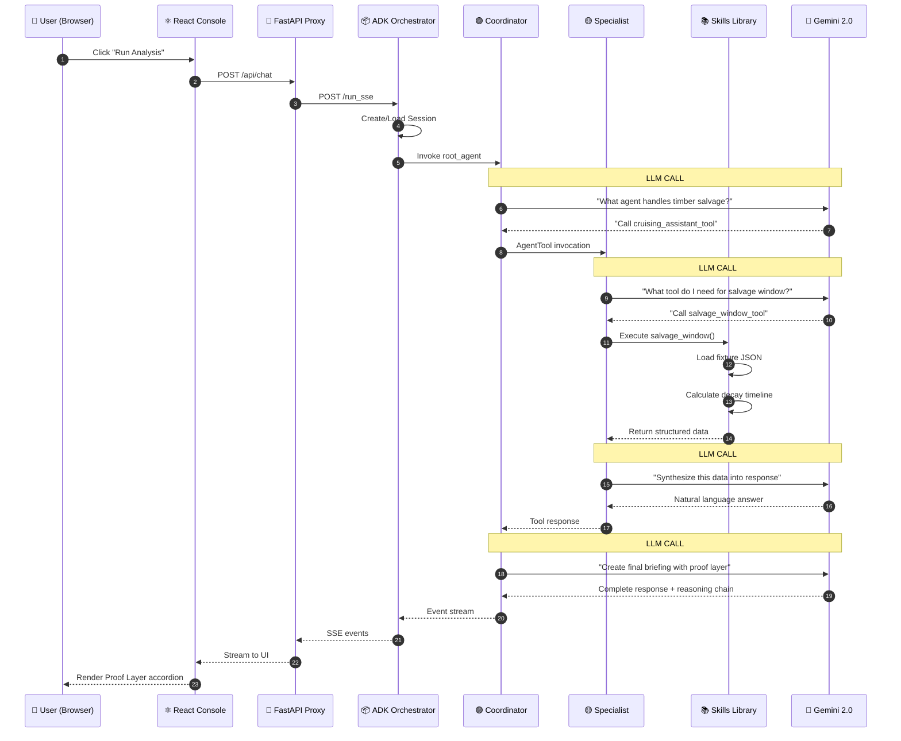

### 2.2 What Happens at Each Step

| Step | Component | Action | LLM? | Latency |
|------|-----------|--------|------|---------|
| 1-2 | Browser → React | User clicks button, React captures input | ❌ | ~10ms |
| 3 | React → FastAPI | HTTP POST with query payload | ❌ | ~50ms |
| 4 | FastAPI → ADK | Forward to ADK orchestrator | ❌ | ~100ms |
| 5 | ADK | Create session, load agent | ❌ | ~200ms |
| 6-7 | Coordinator | **LLM Call #1**: Decide which specialist | ✅ | ~1.5s |
| 8 | Coordinator → Specialist | AgentTool wrapper invocation | ❌ | ~50ms |
| 9-10 | Specialist | **LLM Call #2**: Decide which tool | ✅ | ~1.5s |
| 11-13 | Specialist → Skills | Execute Python function, load JSON | ❌ | ~50ms |
| 14-15 | Specialist | **LLM Call #3**: Synthesize tool output | ✅ | ~2s |
| 16 | Specialist → Coordinator | Return structured response | ❌ | ~50ms |
| 17-18 | Coordinator | **LLM Call #4**: Final synthesis | ✅ | ~2s |
| 19-22 | ADK → User | Stream SSE events to browser | ❌ | ~100ms |

**Total: ~8 seconds** (4 LLM calls × ~2s each)

---

## 3. Component Matrix

### 3.1 Where Things Live

| Component | Location | Runtime | Uses Gemini? | Cost Driver |
|-----------|----------|---------|--------------|-------------|
| **React Console** | Browser | Client-side JS | ❌ No | Free |
| **FastAPI Proxy** | Cloud Run `:8000` | Python (uvicorn) | ❌ No | Compute |
| **ADK Orchestrator** | Cloud Run (in-process) | Python | ❌ No | Compute |
| **Recovery Coordinator** | `agents/coordinator/` | ADK LlmAgent | ✅ **YES** | **Tokens** |
| **Burn Analyst** | `agents/burn_analyst/` | ADK LlmAgent | ✅ **YES** | **Tokens** |
| **Trail Assessor** | `agents/trail_assessor/` | ADK LlmAgent | ✅ **YES** | **Tokens** |
| **Cruising Assistant** | `agents/cruising_assistant/` | ADK LlmAgent | ✅ **YES** | **Tokens** |
| **NEPA Advisor** | `agents/nepa_advisor/` | ADK LlmAgent | ✅ **YES** | **Tokens** |
| **Skills Library** | `agents/*/skills/` | Pure Python | ❌ No | Free |
| **MCP Servers** | Cloud Run (future) | Python/Node | ❌ No | API costs |
| **Fixtures** | `data/fixtures/` | JSON files | ❌ No | Free |
| **Vertex AI RAG** | Google Managed | Vertex API | Embedding only | Minimal |

### 3.2 Decision Tree: Does This Use Gemini?

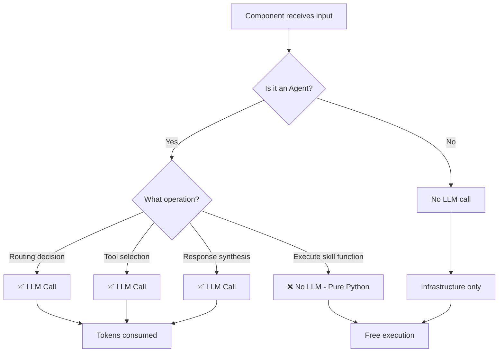

---

## 4. LLM Call Patterns

### 4.1 The Four-Call Pattern

A typical single-specialist query generates **4 LLM calls**:

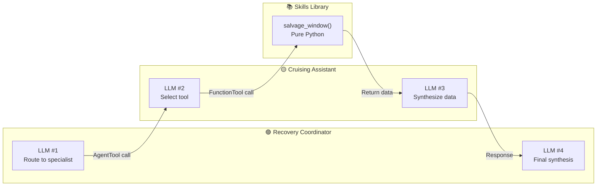

### 4.2 Multi-Specialist Queries

When the Coordinator needs multiple specialists (e.g., "Give me a full recovery briefing"):

```
Query: "What's the recovery status for Cedar Creek?"

Coordinator LLM #1: "I need ALL specialists for this"
├── Burn Analyst: LLM #2 (route) + LLM #3 (synthesize) 
├── Trail Assessor: LLM #4 (route) + LLM #5 (synthesize)
├── Cruising Assistant: LLM #6 (route) + LLM #7 (synthesize)
└── NEPA Advisor: LLM #8 (route) + LLM #9 (synthesize)
Coordinator LLM #10: "Final cross-domain synthesis"

Total: 10 LLM calls (~20 seconds, ~10,000 tokens)
```

### 4.3 Token Breakdown

| Call Type | Typical Input Tokens | Typical Output Tokens | Cost @ Flash Pricing |
|-----------|---------------------|----------------------|---------------------|
| **Route Decision** | 500 | 100 | $0.0004 |
| **Tool Selection** | 800 | 150 | $0.0006 |
| **Data Synthesis** | 1,200 | 500 | $0.0015 |
| **Final Briefing** | 1,500 | 800 | $0.0025 |
| **Single Query Total** | ~4,000 | ~1,550 | **~$0.005** |

**Pricing Reference (Gemini 2.0 Flash):**
- Input: $0.075 per 1M tokens
- Output: $0.30 per 1M tokens

---

## 5. Skills Library Architecture

### 5.1 The Skills-First Principle (ADR-005)

> **"Agents are reasoning engines, not knowledge stores."**

Skills contain:
1. **`skill.md`** — Instructions for the LLM (prompt engineering)
2. **`*.py`** — Pure Python logic (NO LLM calls)
3. **`*.json`** — Configuration, thresholds, reference data

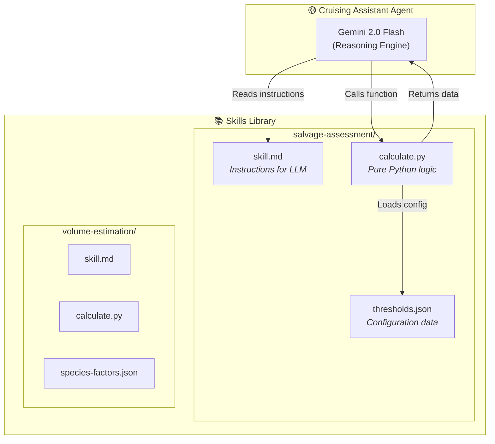

### 5.2 Skill Execution Flow

```python
# Example: agents/cruising_assistant/skills/salvage-assessment/calculate.py

def assess_salvage_viability(plot_id: str, fire_id: str) -> dict:
    """
    Pure Python function - NO LLM calls here!
    This executes in ~50ms, costs $0.00
    """
    # Load fixture data (Phase 1) or call MCP (Phase 2)
    plot_data = load_fixture(fire_id, "timber-plots.json")
    plot = find_plot(plot_data, plot_id)
    
    # Load thresholds from JSON config
    thresholds = load_json("thresholds.json")
    
    # Pure Python calculation
    days_since_fire = calculate_days_since(plot["fire_date"])
    decay_factor = calculate_decay(plot["species"], days_since_fire)
    viability_score = 100 - (decay_factor * 100)
    
    # Return structured data for LLM to synthesize
    return {
        "plot_id": plot_id,
        "species": plot["species"],
        "days_since_fire": days_since_fire,
        "viability_score": viability_score,
        "recommendation": "SALVAGE" if viability_score > 60 else "EXPIRED",
        "data_source": "RANGER fixtures",
        "confidence": 0.85
    }
```

### 5.3 Why This Matters for Cost

```
┌─────────────────────────────────────────────────────────────────┐
│  COST COMPARISON: LLM vs Skills                                  │
├─────────────────────────────────────────────────────────────────┤
│                                                                  │
│  ❌ BAD: Put calculation logic in LLM prompt                    │
│     "Calculate the decay factor using formula X..."             │
│     → LLM thinks about math for 2 seconds                       │
│     → Consumes 500+ tokens                                      │
│     → Costs $0.002 per calculation                              │
│     → May get wrong answer!                                     │
│                                                                  │
│  ✅ GOOD: Put calculation logic in Python skill                 │
│     def calculate_decay(species, days): return days * factor    │
│     → Executes in 5ms                                           │
│     → Consumes 0 tokens                                         │
│     → Costs $0.00                                               │
│     → Deterministic, testable, correct                          │
│                                                                  │
│  SAVINGS: 100% of calculation costs                             │
└─────────────────────────────────────────────────────────────────┘
```

---

## 6. MCP Data Flow

### 6.1 Phase 1: Fixtures (Current)

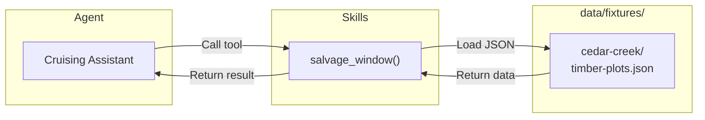

### 6.2 Phase 2: Live APIs (Future)

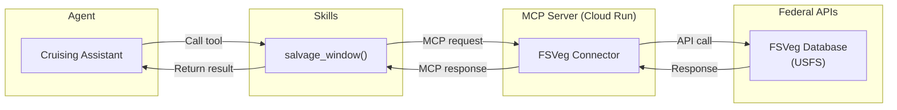

### 6.3 MCP as Backend Gateway

> **MCP Servers are like an API gateway for the backend** — they abstract where data comes from. The agent code doesn't change; only the MCP server implementation changes.

| Data Source | Phase 1 (Demo) | Phase 2 (Production) |
|-------------|----------------|----------------------|
| **Fire Incidents** | `incident-metadata.json` | IRWIN API |
| **Fire Perimeters** | `perimeters.geojson` | NIFC GeoMAC API |
| **Burn Severity** | `burn-severity.json` | MTBS API / GEE |
| **Trail Damage** | `trail-damage.json` | TRACS API |
| **Timber Inventory** | `timber-plots.json` | FSVeg API |
| **NEPA Regulations** | Vertex AI RAG | Vertex AI RAG |

---

## 7. Cost Model

### 7.1 Per-Request Cost

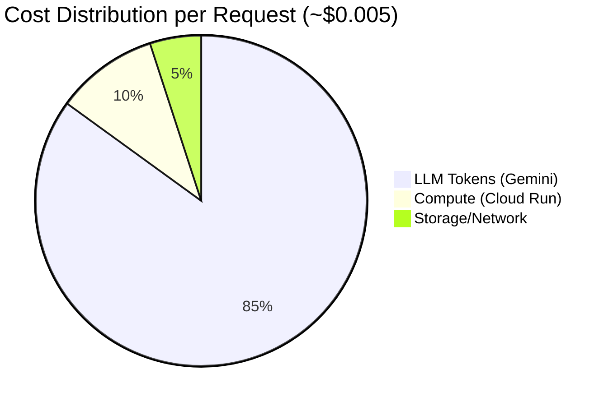

### 7.2 Monthly Projections

| Usage Level | Requests/Month | LLM Cost | Compute Cost | Total |
|-------------|----------------|----------|--------------|-------|
| **Development** | 500 | $2.50 | $50 | ~$55 |
| **Pilot (1 Region)** | 5,000 | $25 | $100 | ~$125 |
| **Production (Multi-Region)** | 50,000 | $250 | $300 | ~$550 |
| **Fire Season Peak** | 200,000 | $1,000 | $500 | ~$1,500 |

### 7.3 Cost Optimization Strategies

```
┌─────────────────────────────────────────────────────────────────┐
│  STRATEGY 1: Minimize LLM Calls                                  │
├─────────────────────────────────────────────────────────────────┤
│  • Cache common routing decisions                               │
│  • Pre-compute briefings for known fire perimeters              │
│  • Batch multiple queries into single coordinator call          │
└─────────────────────────────────────────────────────────────────┘

┌─────────────────────────────────────────────────────────────────┐
│  STRATEGY 2: Maximize Skill Logic                                │
├─────────────────────────────────────────────────────────────────┤
│  • Move ALL calculations to Python (not LLM prompts)            │
│  • Pre-compute viability scores in fixtures                     │
│  • Use lookup tables instead of LLM reasoning                   │
└─────────────────────────────────────────────────────────────────┘

┌─────────────────────────────────────────────────────────────────┐
│  STRATEGY 3: Optimize Token Usage                                │
├─────────────────────────────────────────────────────────────────┤
│  • Keep system prompts concise                                  │
│  • Return structured data, not prose                            │
│  • Use Gemini Flash (not Pro) for all agents                    │
└─────────────────────────────────────────────────────────────────┘
```

---

## 8. Network & Session Details

### 8.1 Port Assignments

| Port | Component | Protocol | Purpose |
|------|-----------|----------|---------|
| `3000` | React Dev Server | HTTP | Frontend development |
| `8000` | FastAPI Backend | HTTP/SSE | API proxy + ADK |
| `8080` | Cloud Run (prod) | HTTPS | Production backend |
| `443` | Vertex AI | HTTPS | Gemini API calls |
| `55xxx` | Browser (ephemeral) | TCP | Client source port |

### 8.2 Ephemeral Ports Explained

When you see `127.0.0.1:55812` in logs:

```
┌─────────────────────────────────────────────────────────────────┐
│  TCP CONNECTION ANATOMY                                          │
├─────────────────────────────────────────────────────────────────┤
│                                                                  │
│  Browser                          Backend                        │
│  ┌─────────────┐                 ┌─────────────┐                │
│  │ Chrome      │                 │ FastAPI     │                │
│  │             │  ──────────────>│             │                │
│  │ src: 55812  │                 │ dst: 8000   │                │
│  │ (random)    │  <──────────────│ (fixed)     │                │
│  └─────────────┘                 └─────────────┘                │
│                                                                  │
│  55812 = Ephemeral port (changes every connection)              │
│  8000  = Server port (fixed, you configured this)               │
│                                                                  │
│  The ephemeral port is NOT related to sessions!                 │
└─────────────────────────────────────────────────────────────────┘
```

### 8.3 Session Management

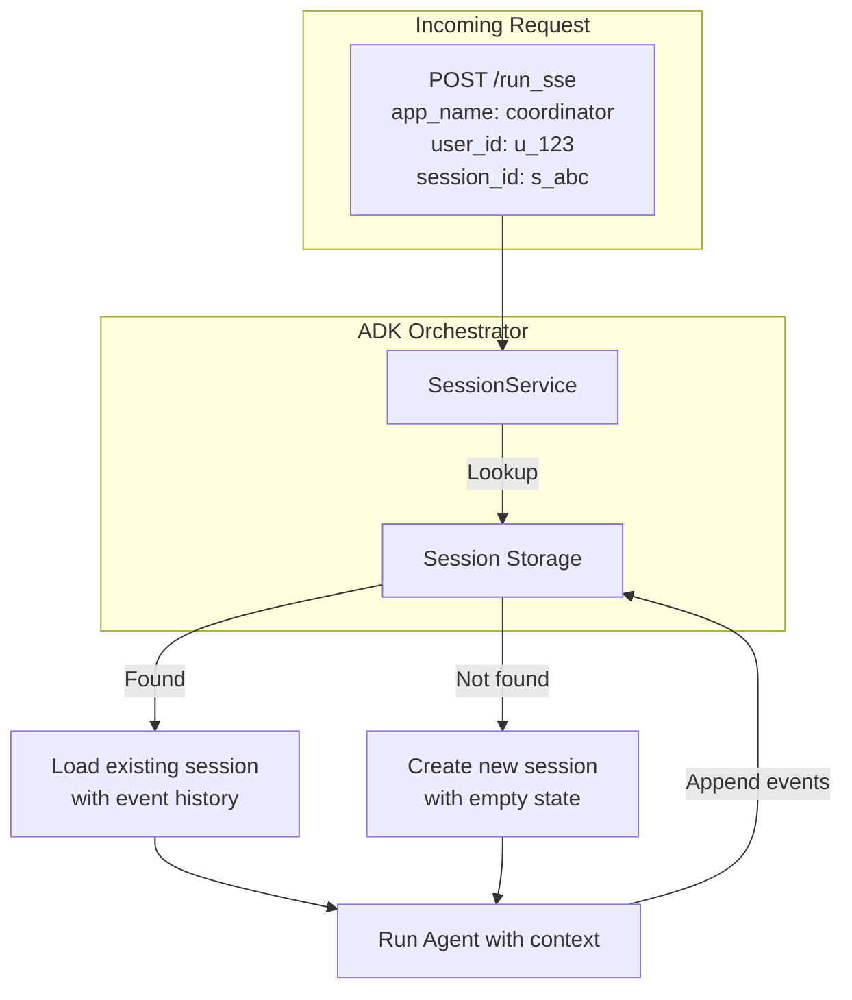

**Session Storage Options:**

| Phase | Storage | Persistence | Multi-User |
|-------|---------|-------------|------------|
| **Development** | In-Memory | ❌ Lost on restart | ❌ Single user |
| **Phase 1 Demo** | SQLite | ✅ Local file | ❌ Single user |
| **Phase 2 Production** | Firestore | ✅ Durable | ✅ Multi-user |

---

## 9. Diagrams

### 9.1 Complete System Architecture

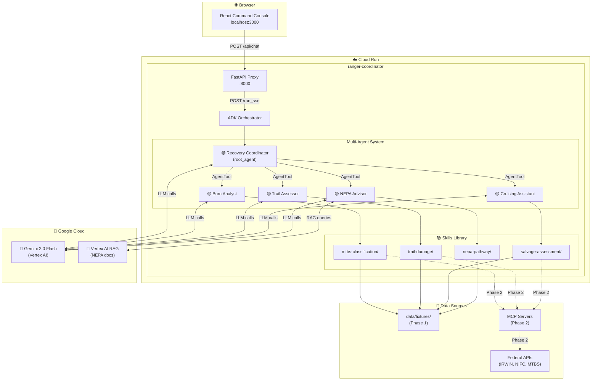

### 9.2 LLM Token Flow

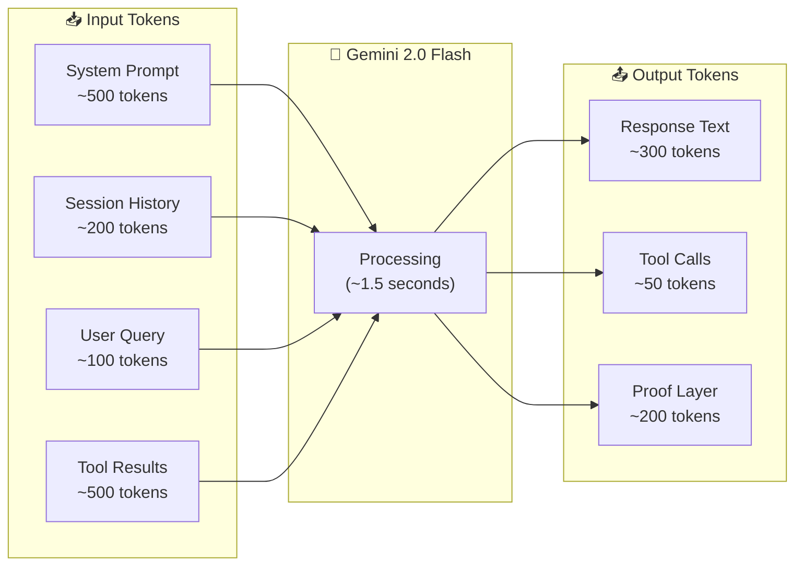

### 9.3 Proof Layer Data Flow

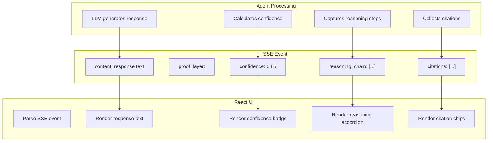

---

## Appendix A: Log Analysis Reference

### Sample Log with Annotations

```log
# Health check (FastAPI responds)
INFO: 127.0.0.1:55812 - "GET /health HTTP/1.1" 200 OK

# CORS preflight (browser security check)
INFO: 127.0.0.1:55814 - "OPTIONS /run_sse HTTP/1.1" 200 OK

# Session creation (ADK creates SQLite record)
DEBUG: Created session e267bff1-0448-44fa-9854-955f3dc4c63d

# SSE stream starts
INFO: 127.0.0.1:55816 - "POST /run_sse HTTP/1.1" 200 OK

# LLM Call #1 - Coordinator routing decision
DEBUG: LLM request to Vertex AI (model: gemini-2.0-flash)
DEBUG: Input tokens: 542, Output tokens: 87

# Tool invocation - Coordinator calls Cruising Assistant
DEBUG: TOOL_CALL: cruising_assistant_tool

# LLM Call #2 - Specialist tool selection
DEBUG: LLM request to Vertex AI (model: gemini-2.0-flash)
DEBUG: Input tokens: 823, Output tokens: 156

# Skill execution (NO LLM - pure Python)
DEBUG: Executing salvage_window() with plot_id=47-ALPHA
DEBUG: Loaded fixture: cedar-creek/timber-plots.json
DEBUG: Calculation complete in 47ms

# LLM Call #3 - Specialist synthesis
DEBUG: LLM request to Vertex AI (model: gemini-2.0-flash)
DEBUG: Input tokens: 1247, Output tokens: 512

# LLM Call #4 - Coordinator final synthesis
DEBUG: LLM request to Vertex AI (model: gemini-2.0-flash)
DEBUG: Input tokens: 1534, Output tokens: 823

# Response complete
DEBUG: Total processing time: 7782ms
DEBUG: Total tokens: 4146 input, 1578 output
```

---

## Appendix B: Glossary

| Term | Definition |
|------|------------|
| **ADK** | Agent Development Kit — Google's framework for building AI agents |
| **AgentTool** | ADK pattern for wrapping one agent as a tool callable by another |
| **Ephemeral Port** | Random TCP port assigned by OS for client connections |
| **Fixture** | Mock data file used for development/demo (JSON format) |
| **MCP** | Model Context Protocol — standard for LLM tool connectivity |
| **Proof Layer** | Transparency metadata: confidence, reasoning chain, citations |
| **RAG** | Retrieval Augmented Generation — grounding LLM with documents |
| **Skill** | Portable package of domain logic: instructions + code + config |
| **SSE** | Server-Sent Events — HTTP streaming protocol for real-time updates |

---

**Document Owner:** RANGER Architecture Team  
**Last Updated:** 2025-12-30  
**Status:** Active — validated against Phase 1 deployment
