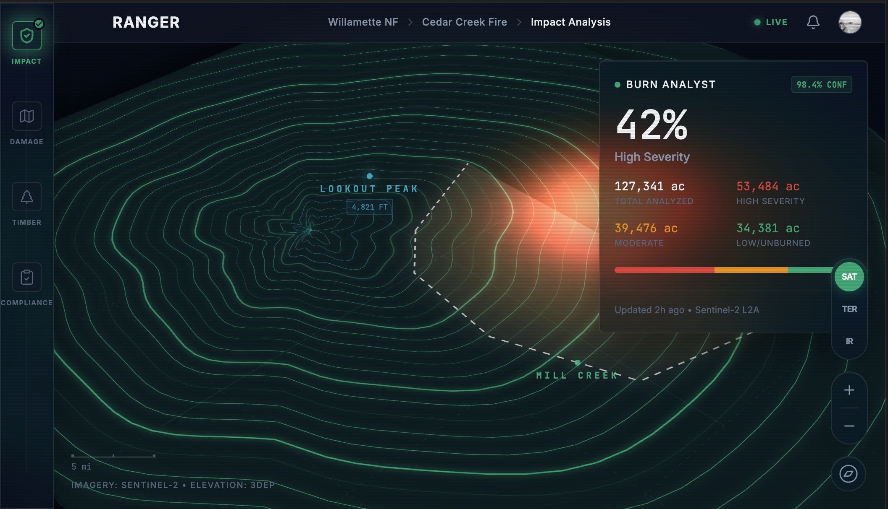

# RANGER Command Console: UI/UX Vision

This document defines the design vision for the RANGER Command Console — a "Command & Control" interface for the US Forest Service that transitions from macro-level situational awareness to high-fidelity 3D "Digital Twin" visualization of specific forest fire sites.

> **Note:** The mockups referenced in this document represent the target user experience for the Command Console. They illustrate the intended design direction and component structure, not a strict implementation timeline.

## 1. Tactical Forest Intelligence

The interface is built on the principle of **"Macro-to-Micro Intelligence."** It allows strategic planners to see the entire national landscape and then dive into a hyper-detailed "Digital Twin" of a specific fire event.

### Core Design Features

1.  **3D Digital Twin Engine:** The central viewport displays a photorealistic 3D model of the forest, overlaying real-time AI detections like burn severity and heat signatures directly onto the terrain.
2.  **Post-Fire Lifecycle Rail:** The left-hand sidebar provides direct access to the four core AI agents ("The Crew"):
    - **Impact (Burn Analyst):** Satellite-based burn severity assessment.
    - **Damage (Trail Assessor):** Computer vision identification of trail washouts and infrastructure damage.
    - **Timber (Cruising Assistant):** Multimodal data collection for salvage logging operations.
    - **Compliance (NEPA Advisor):** AI-assisted regulatory workflows and document generation.
3.  **AI Insight HUD:** Translucent, glassmorphic panels provide high-level metrics, AI-generated insights, and "What-If" scenarios such as estimated timber loss or recovery timelines.

## 2. Design Mockups: "The Ranger's Command Console"

### V2: Hero Mockup (3D Terrain Visualization)

*Approved v2 hero mockup — December 2025. This represents the **IMPACT** lifecycle view.*

**Key Features (IMPACT View):**
- **3D Terrain:** Organic topographic contours with 25 elevation layers, isometric perspective.
- **Fire Visualization:** Pulsing thermal gradient representing burn intensity/severity.
- **Tactical HUD:** Coordinate grid, crosshairs, and dot grid overlay.
- **Lifecycle Context:** This shows the initial assessment phase where satellite data defines the fire's footprint.

### UI Framework: Shared Chrome vs. View-Specific Content

The Command Console uses a unified shell ("The Chrome") that persists across all lifecycle views, while the central viewport and side panels reflect the active agent's focus.

| Component | Type | Description |
|-----------|------|-------------|
| **Navigation Header** | Shared | Branding, global search, and fire event selector. |
| **Lifecycle Rail** | Shared | Vertical navigation between IMPACT, DAMAGE, TIMBER, and COMPLIANCE. |
| **3D Terrain Engine** | Shared | The base digital twin (3DEP terrain + satellite base maps). |
| **Agent Insight Panel** | View-Specific | The glassmorphic HUD that changes content based on the active agent (e.g., Burn Analyst metrics vs. Trail Assessor work orders). |
| **Tactical Overlays** | View-Specific | Map layers (burn severity dNBR, trail GPS lines, timber stand polygons) specific to the workflow. |
| **Multimodal Controls** | Shared | View toggles (Sat/3D/IR), zoom, and orientation controls. |

## 3. Design Philosophy: "Tactical Futurism"

The RANGER Command Console aesthetic is inspired by military-grade situational awareness interfaces (F-35 cockpit HUD) combined with the precision and clarity of National Geographic visualization.

### Design Principles

- **Dark Mode Only:** Reduces eye strain for operators working in low-light command centers or field conditions. Provides optimal contrast for high-stakes decision-making environments.
- **Glassmorphism:** Layered translucent UI elements with backdrop blur keep the focus on the primary 3D map while providing contextual information. Panels "float" above the terrain without obscuring critical data.
- **Emergency Management Color Palette:** Uses standardized severity colors to signal urgency and safety levels at a glance:
  - **Safe Green** (`#10B981`): Low severity, success states, confirmed data
  - **Warning Amber** (`#F59E0B`): Moderate severity, caution, pending actions
  - **Severe Red** (`#EF4444`): High severity, critical alerts, urgent intervention required
- **Typographic Hierarchy:** Monospace fonts for data precision (coordinates, measurements), sans-serif for readability (labels, descriptions).
- **Animation as Feedback:** Subtle micro-interactions (hover states, loading pulses, transition easing) provide system status feedback without distraction.

### Visual References

The mockups in `docs/assets/mockup-iterations/` demonstrate this philosophy through:
- High-contrast topographic relief rendering
- Pulsing thermal gradients for fire visualization
- Translucent metric cards with backdrop blur
- Tactical grid overlays and coordinate systems
