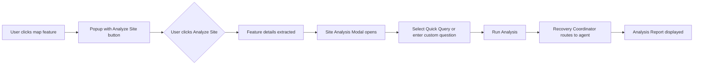

# RANGER Site Analysis: Feature-Triggered Field Assessment

> [!IMPORTANT]
> **Standard:** This document is aligned with **[ADR-005: Skills-First Architecture](../adr/ADR-005-skills-first-architecture.md)**. Site Analysis queries are handled by specialized **Skills** (e.g., `nepa-advisor`, `burn-analyst`) orchestrated via Google ADK.

> **Status**: Approved (Post-UX Review)  
> **Version**: 2.0  
> **Author**: RANGER Development Team  
> **Date**: December 23, 2024  
> **Related**: Recovery Coordinator Cascade, BAER Team Workflows

---

## Executive Summary

**Site Analysis** enables users to trigger deep field assessments directly from any map feature popup. Instead of drawing a selection box, users click on a damage point, timber plot, or burn zone, then press the **"Analyze Site"** button to launch an AI-powered investigation with full semantic context.

This approach embodies RANGER's core philosophy: **"Real AI responses, not fixtures."**

> *"You're building for scientists who happen to work in the forest, not soldiers who happen to fight fires."*  
> — UX Review Feedback

---

## Design Language: Tactical Futurism (Refined)

This feature adheres to RANGER's established design system while respecting USFS institutional culture:

| Element | Specification |
|---------|---------------|
| **Color System** | Dark mode (`#020617` background), glassmorphism panels |
| **Accent** | `accent-cyan` (`#06B6D4`) for interactive elements |
| **Phase Colors** | Inherit from clicked feature's workflow phase |
| **Typography** | Inter (sans), JetBrains Mono (data/metrics) |
| **Iconography** | Lucide React icons, consistent weight |
| **Motion** | `animate-in`, subtle backdrop-blur transitions |
| **Language** | USFS-aligned terminology (see Naming Convention below) |

---

## Naming Convention (UX-Reviewed)

Following USFS institutional language patterns:

| Term | Definition |
|------|------------|
| **Site Analysis** | Primary feature name (standard USFS term) |
| **Quick Queries** | Pre-composed question chips |
| **Selected Feature** | The feature being analyzed |
| **Feature Details** | Automatic metadata extracted from feature |
| **Run Analysis** | The action button text |
| **Analysis Report** | The output document |

**Rejected alternatives (per UX review):**
- ~~"Intel Probe"~~ — Too military/tactical
- ~~"Research Mission"~~ — Command-and-control language
- ~~"Intelligence Briefing"~~ — Military intelligence terminology

**"Site Analysis"** fits USFS science-based culture alongside terms like "field assessment," "resource evaluation," and "BAER analysis."

---

## Visual Design

### Feature Popup with Site Analysis Button

```
┌─────────────────────────────────────────────────────┐
│  Hills Creek Trail #3510                       ✕    │
│  ━━━━━━━━━━━━━━━━━━━━━━━━━━━━━━━━━━━━━━━━━━━━━━━━━ │
│  BRIDGE FAILURE                                     │
│                                                     │
│  Primary bridge over Hills Creek destroyed.         │
│  Critical access point.                             │
│                                                     │
│  ┌─────────────┐                                    │
│  │ Severity    │  ██████████ 5/5                    │
│  └─────────────┘                                    │
│                                                     │
│  ┌─────────────────────────────────────────────┐    │
│  │  🔍  ANALYZE SITE                           │    │
│  │     Cross-reference with USFS records       │    │
│  └─────────────────────────────────────────────┘    │
│                                                     │
│                    HC-001                           │
└─────────────────────────────────────────────────────┘
```

### Button Styling

```css
/* Site Analysis Button - RANGER accent system */
.site-analysis-btn {
  @apply flex items-center gap-2 w-full;
  @apply px-4 py-2 mt-4;  /* Increased padding for glove-friendly touch */
  @apply bg-accent-cyan/10 hover:bg-accent-cyan/20;
  @apply border border-accent-cyan/30 hover:border-accent-cyan/50;
  @apply rounded-lg transition-all;
  @apply text-accent-cyan text-xs font-bold uppercase tracking-widest;
  min-height: 44px;  /* WCAG touch target minimum */
}

.site-analysis-btn:active {
  @apply scale-[0.98];
}
```

### Icon Selection

**Recommended:** `Search` icon from Lucide (professional, investigative)

```tsx
import { Search } from 'lucide-react';

<button className="site-analysis-btn">
  <Search className="w-4 h-4" />
  <span>Analyze Site</span>
</button>
```

---

## Color Integration

Site Analysis inherits the **phase color** of the feature being analyzed:

| Feature Type | Workflow Phase | Color | Hex |
|--------------|----------------|-------|-----|
| Burn zones | Impact | Red | `#ef4444` |
| Trail damage | Damage | Amber | `#f59e0b` |
| Timber plots | Timber | Emerald | `#10b981` |
| Compliance markers | Compliance | Purple | `#a855f7` |

---

## User Flow



---

## Quick Queries: Human-Centered Design (UX-Reviewed)

### Design Philosophy

Experienced foresters ask predictable questions. They don't want to type—they want to click and go. **Quick Queries** are pre-composed questions that appear based on the feature type, allowing users to analyze with a single click.

> *"I've been doing this for 25 years. I know what questions to ask. I just don't want to type them every time."*  
> — District Ranger persona

### Visual Design (2-Column Layout per UX Review)

```
┌─────────────────────────────────────────────────────────────────────────┐
│  SITE ANALYSIS: HILLS CREEK TRAIL #3510                            ✕    │
│  [🥾] Trail Infrastructure                                              │
│  ━━━━━━━━━━━━━━━━━━━━━━━━━━━━━━━━━━━━━━━━━━━━━━━━━━━━━━━━━━━━━━━━━━━━━ │
│                                                                         │
│  DAMAGE SEVERITY: ████████████ 5/5 (Critical)                           │
│                                                                         │
│  QUICK QUERIES                                           Select any ▾   │
│  ┌─────────────────────────────┐ ┌─────────────────────────────┐        │
│  │ ☐ Check NFS database        │ │ ☐ Maintenance history       │        │
│  └─────────────────────────────┘ └─────────────────────────────┘        │
│  ┌─────────────────────────────┐ ┌─────────────────────────────┐        │
│  │ ☐ BAER history              │ │ ☐ Hazard trees              │        │
│  └─────────────────────────────┘ └─────────────────────────────┘        │
│  ┌─────────────────────────────┐ ┌─────────────────────────────┐        │
│  │ ☐ Wilderness boundary       │ │ ☐ Tribal consultation       │        │
│  └─────────────────────────────┘ └─────────────────────────────┘        │
│                                                                         │
│  CUSTOM QUESTION                                       FIELD REFINEMENT │
│  ┌─────────────────────────────────────────────────────────────────┐   │
│  │ Check NFS database. Find maintenance history for this trail... │   │
│  │                                                                 │   │
│  └─────────────────────────────────────────────────────────────────┘   │
│                                                                         │
│                    CANCEL                    RUN ANALYSIS               │
└─────────────────────────────────────────────────────────────────────────┘
```

### Query Categories by Feature Type (Revised per UX Review)

#### Trail & Infrastructure Damage (Amber Phase)

| Chip Label | Full Query Text | Why Foresters Ask This |
|------------|-----------------|------------------------|
| **Check NFS database** | "Confirm official USFS designation for this trail/facility. Cross-check NFS database for naming discrepancies." | Data entry errors are common. Official trail IDs may differ from informal names. |
| **Maintenance history** | "Find any prior maintenance records, repairs, or work orders at this location." | History predicts future problems. Repeat failures indicate systemic issues. |
| **BAER history** | "Check for previous BAER (Burned Area Emergency Response) reports affecting this area." | BAER teams may have assessed this exact location after prior fires. |
| **Hazard trees** | "Identify known hazard tree zones or unstable slopes near this location." | Crew safety is paramount. Widow-makers kill people. |
| **Access status** | "Check current road/trail access status and any required detour routes." | Can we get equipment there? Is the access road washed out? |
| **Repair cost comparables** | "Find comparable repair cost estimates for similar damage types in this region." | Need budget justification before I can request funds. |
| **Wilderness boundary** | "Verify proximity to Wilderness or other special management areas." | Different rules apply. Chainsaw restrictions. No motorized. |
| **Tribal consultation** | "Check for tribal consultation requirements or cultural resource concerns." | Mandatory for many areas. NHPA compliance required. |

#### Timber Plots (Emerald Phase)

| Chip Label | Full Query Text | Why Foresters Ask This |
|------------|-----------------|------------------------|
| **Time left to salvage** | "Estimate remaining salvage window for fire-killed timber in this stand (typically 12-18 months for conifers)." | Wood value degrades rapidly. Time is money. |
| **ESA concerns** | "Check for endangered species habitats or surveys required in this unit." | Can't sell timber if there's a spotted owl nest. |
| **Past sales/litigation** | "Find any prior timber sales, appeals, or litigation in this planning area." | Controversial history affects new proposals. |
| **Log haul routes** | "Assess log haul route feasibility, seasonal restrictions, and road weight limits." | Wet-weather restrictions? Spring breakup? |
| **Nearby resources** | "Identify adjacent high-value resources (recreation sites, watersheds, wildlife areas)." | Social license matters. Don't surprise the public. |
| **Market conditions** | "Current salvage timber market conditions and mill capacity in this region." | No point selling if mills are full or prices crashed. |
| **Pending litigation** | "Check for any pending litigation or appeals related to this area or adjacent sales." | Kills sales if not addressed early. |

#### Burn Severity Zones (Red Phase)

| Chip Label | Full Query Text | Why Foresters Ask This |
|------------|-----------------|------------------------|
| **Pre-fire conditions** | "Document pre-fire vegetation conditions and stand composition for NEPA baseline." | Need baseline for comparison. What did we lose? |
| **Fire progression** | "Reconstruct fire progression timeline through this specific area." | Was this area spot fires or main fire? Behavior differs. |
| **Erosion risk** | "Assess soil damage intensity and erosion risk classification for this slope." | High-severity burn + steep slope = debris flow potential. |
| **Drinking water concerns** | "Identify downstream municipal water supply concerns and treatment implications." | Cities downstream care about their drinking water. |
| **Comparison fires** | "Find comparable burn severity patterns from prior fires in this forest." | Reference conditions help set realistic expectations. |
| **Reforestation needs** | "Estimate reforestation urgency and site preparation requirements." | High-severity stands may need planting within 3-5 years. |
| **Invasive species** | "Check for invasive species concerns in post-fire environment." | Post-fire explosion risk for invasives. |

#### Compliance Markers (Purple Phase)

| Chip Label | Full Query Text | Why Foresters Ask This |
|------------|-----------------|------------------------|
| **NEPA status** | "Check for pending or on-hold NEPA actions in this project area." | Is there already a CE in progress? Don't duplicate effort. |
| **Section 7** | "Identify Section 7 ESA consultation requirements for this area." | Biological opinions can take 6+ months. Start early. |
| **Cultural resources** | "Check for known cultural resource sites or required survey areas." | Tribal consultation is required. NHPA compliance is mandatory. |
| **Wilderness boundary** | "Verify proximity to Wilderness or other special management areas." | Different rules apply. Chainsaw restrictions. No motorized. |
| **County coordination** | "Check for county road agreements or local government coordination needs." | County commissioners get upset when they're surprised. |
| **Public comments** | "Find any prior public comments or objections related to this area." | Know your opposition before they know you're coming. |

### Chip Selection Behavior

1. **Multi-select allowed** — User can check multiple chips
2. **Additive** — Each selected chip appends its full query text to the textarea
3. **Editable** — User can modify the assembled query before launching
4. **Order preserved** — Queries appear in the order chips were selected
5. **Clear all** — Button to deselect all chips and clear textarea

### UX Enhancements (from Review)

1. **Chip tooltips** — Hover to see full query text before selecting
2. **Chip count badge** — "3 queries selected" indicator
3. **Estimated time** — "~30 sec analysis" based on query complexity
4. **Feature type indicator** — Icon + label showing what kind of feature (Trail, Timber, Burn Zone)
5. **Severity display** — Show damage severity prominently when available
6. **2-column layout** — Better readability for longer chip labels

---

## Edge Cases (from UX Review)

### 1. No Records Found
```
━━━━━━━━━━━━━━━━━━━━━━━━━━━━━━━━━━━
ANALYSIS REPORT: HILLS CREEK TRAIL #3510

Query: Find maintenance history for this location

✓ Search completed
❌ No matching records found in:
   • TRACS work orders (2015-2025)
   • Trail maintenance logs
   • Closure notices

💡 This could mean:
   • First documented incident at this location
   • Records not digitized (check archives)
   • Data entry gaps

Confidence: High (comprehensive search)
━━━━━━━━━━━━━━━━━━━━━━━━━━━━━━━━━━━
```

### 2. Conflicting Information
```
⚠️ CONFLICTING INFORMATION FOUND

Source 1: TRACS Work Order #45821 (2023-11-15)
"Hills Creek Trail #3510 closed indefinitely due to bridge failure"

Source 2: R6 Trail Status Update (2024-03-22)
"Hills Creek Trail #3510 reopened with temporary crossing"

💡 Recommendation: Verify current status with district office
Last updated: 8 months ago
```

### 3. Offline/Limited Connectivity
- Detect connectivity before opening modal
- Show offline indicator: "🔴 Offline — Analysis unavailable"
- Suggest: "Connect to network or use cached reports"

### 4. Long Analysis Time (30+ sec)
```
━━━━━━━━━━━━━━━━━━━━━━━━━━━━━━━━━━━
ANALYSIS IN PROGRESS

Searching: TRACS database ✓
Searching: BAER reports ⏳ (15 sec)
Searching: NFS records ⏳

Estimated time: 20 seconds remaining

[CANCEL ANALYSIS]
━━━━━━━━━━━━━━━━━━━━━━━━━━━━━━━━━━━
```

---

## Accessibility (Field-Specific)

| Requirement | Implementation |
|-------------|----------------|
| **Keyboard nav** | Button focusable, Enter/Space triggers |
| **Screen reader** | `aria-label="Run site analysis for {feature.name}"` |
| **Focus ring** | `focus-visible:ring-2 focus-visible:ring-accent-cyan` |
| **Motion respect** | `prefers-reduced-motion` disables scale transition |
| **Touch targets** | Minimum 44x44px for glove-friendly use |
| **High contrast** | Future: Add high-contrast mode for sunlight |
| **Connectivity** | Show connection quality indicator |

---

## Technical Implementation

### 1. Add Site Analysis to Feature Popup

**File:** Create `apps/command-console/src/components/map/SiteAnalysisButton.tsx`

```tsx
import { Search } from 'lucide-react';
import { useVisualAuditStore } from '@/stores/visualAuditStore';

interface SiteAnalysisButtonProps {
  feature: {
    id: string;
    properties: Record<string, any>;
    geometry: GeoJSON.Geometry;
    layer: { id: string };
  };
  onClose: () => void;
}

export const SiteAnalysisButton: React.FC<SiteAnalysisButtonProps> = ({ 
  feature, 
  onClose 
}) => {
  const setMetadata = useVisualAuditStore((s) => s.setMetadata);
  const setStatus = useVisualAuditStore((s) => s.setStatus);

  const handleAnalyze = () => {
    // Extract feature details
    setMetadata({
      featureId: feature.properties.damage_id || feature.id,
      featureType: feature.layer.id,
      featureName: feature.properties.trail_name || feature.properties.name,
      properties: feature.properties,
      center: feature.geometry.type === 'Point'
        ? feature.geometry.coordinates as [number, number]
        : null,
    });

    // Transition to Site Analysis modal
    setStatus('refining');
    onClose();
  };

  return (
    <button
      onClick={handleAnalyze}
      className="flex items-center gap-2 w-full px-4 py-2 mt-4 
                 bg-accent-cyan/10 hover:bg-accent-cyan/20 
                 border border-accent-cyan/30 hover:border-accent-cyan/50 
                 rounded-lg transition-all min-h-[44px]
                 text-accent-cyan text-xs font-bold uppercase tracking-widest"
      aria-label={`Run site analysis for ${feature.properties.trail_name || feature.id}`}
    >
      <Search className="w-4 h-4" />
      <div className="flex-1 text-left">
        <span>Analyze Site</span>
        <span className="block text-[9px] font-normal normal-case text-text-muted">
          Cross-reference with USFS records
        </span>
      </div>
    </button>
  );
};
```

---

## Scope & Milestones

### Phase 1: MVP (Critical Changes - 4 hours)
- [ ] Rename all UI text from "Intel Probe" → "Site Analysis"
- [ ] Create `SiteAnalysisButton` component
- [ ] Implement revised chip labels
- [ ] Add to trail damage popups

### Phase 2: UX Improvements (8 hours)
- [ ] 2-column chip layout
- [ ] Feature type indicator in modal header
- [ ] Severity display when available
- [ ] Increase touch targets to 44px
- [ ] Add offline detection

### Phase 3: Full Coverage (8 hours)
- [ ] Add Site Analysis to timber plots
- [ ] Add Site Analysis to burn severity zones
- [ ] Add missing chips (wilderness, tribal, litigation)
- [ ] Export to PDF option
- [ ] Recent analyses history

---

---

## Technical Appendix: Configuration & Implementation

### 1. Chip Configuration Structure
See: `src/config/siteAnalysisChips.ts`

Domain-specific query templates for each feature type. Templates use `{placeholders}` that get filled from feature properties.

### 2. Store Integration (Zustand)
Site Analysis state is managed in `visualAuditStore.ts`, tracking `entryMode` ('area' vs 'feature'), feature metadata, and chip selection.

### 3. AI Service Flow
1. **Trigger:** `Analyze Site` button in map popup.
2. **Context:** `startFeatureAnalysis(metadata)` populates store.
3. **Refinement:** User selects chips or enters custom text.
4. **Execution:** `aiBriefingService.query()` sends full context to Recovery Coordinator.

---

## Related Documents

- [UX-REVIEW-SUMMARY.md](./UX-REVIEW-SUMMARY.md) — Full UX review feedback
- [RANGER-DEMO-MANIFESTO.md](../RANGER-DEMO-MANIFESTO.md) — Demo philosophy
- [AGENTIC-ARCHITECTURE.md](../architecture/AGENTIC-ARCHITECTURE.md) — Agent cascade design

---

## Change Log

| Version | Date | Changes |
|---------|------|---------|
| 1.0 | 2024-12-23 | Initial spec with "Intel Probe" naming |
| 2.0 | 2024-12-23 | UX review incorporation: renamed to "Site Analysis", revised chip labels, added missing queries, 2-column layout, accessibility improvements |
