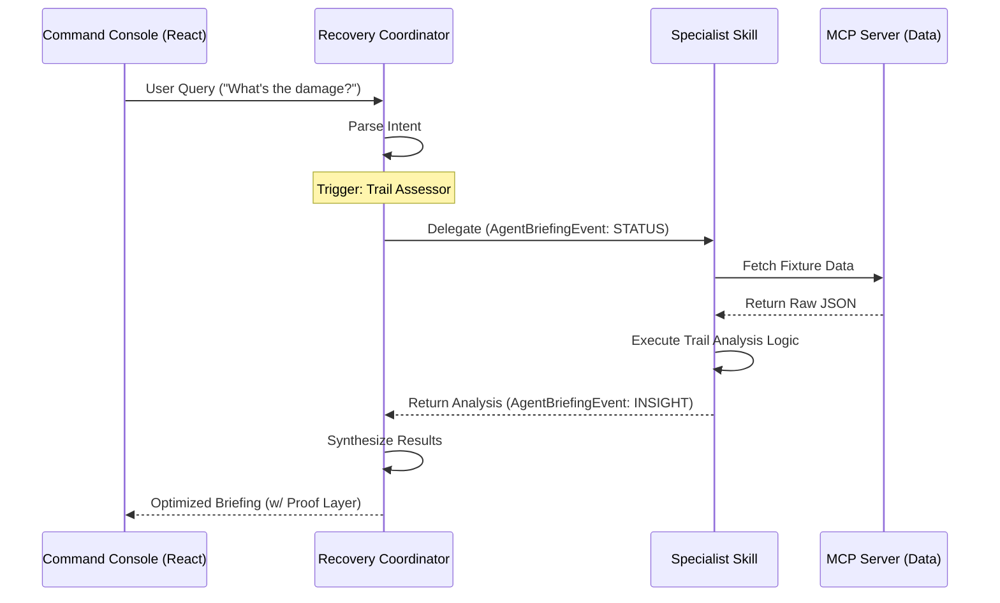

# Protocol: Agent Communication (v1.0)

> [!IMPORTANT]
> **Standard:** This protocol is aligned with **[ADR-005: Skills-First Architecture](../adr/ADR-005-skills-first-architecture.md)** and supersedes all legacy internal messaging drafts.

## 1. Overview
RANGER agents communicate with the **Command Console UI** and each other via structured events. The primary unit of communication is the `AgentBriefingEvent`, designed for real-time streaming, UI reactivity, and the transparent **Proof Layer**.

## 2. Event Schema: AgentBriefingEvent

The following JSON schema defines the mandatory fields for any event destined for the UI.

```json
{
  "$schema": "http://json-schema.org/draft-07/schema#",
  "title": "AgentBriefingEvent",
  "type": "object",
  "required": ["event_id", "correlation_id", "type", "source_agent", "content"],
  "properties": {
    "event_id": { "type": "string", "description": "UUID for this specific event." },
    "correlation_id": { "type": "string", "description": "Session/Incident ID to group related insights." },
    "parent_event_id": { "type": ["string", "null"], "description": "ID of the event that triggered this delegation." },
    "type": { "enum": ["INSIGHT", "ALERT", "ACTION", "STATUS"], "description": "Determines UI rendering priority." },
    "source_agent": { "type": "string", "description": "The Agent (Coordinator or Specialist) emitting the event." },
    "skill_id": { "type": "string", "description": "The specific Skill package (from the Skills Library) that performed the logic." },
    "content": {
      "type": "object",
      "required": ["summary"],
      "properties": {
        "summary": { "type": "string", "description": "One-line summary for toast/header." },
        "detail": { "type": "string", "description": "Main body text (Markdown supported)." },
        "degradation_notice": { "type": "string", "description": "Explanation if data quality is degraded (Tier 2/3)." }
      }
    },
    "proof_layer": {
      "type": "object",
      "properties": {
        "confidence": { "type": "number", "minimum": 0, "maximum": 1 },
        "reasoning_chain": { 
          "type": "array", 
          "items": { "type": "string" },
          "description": "Step-by-step logic trail."
        },
        "citations": {
          "type": "array",
          "items": {
            "type": "object",
            "properties": {
              "source": { "type": "string", "description": "e.g., 'Sentinel-2'" },
              "reference_id": { "type": "string" },
              "snippet": { "type": "string" }
            }
          }
        }
      }
    }
  }
}
```

### 2.1 Confidence Tiers (Degraded Mode)

The `proof_layer.confidence` score indicates the data quality tier:

| Tier | Score Range | Description | Source Example |
|------|-------------|-------------|----------------|
| **1. Authoritative** | 0.90 - 1.00 | Direct, verified data from primary source | `mcp-gis::get_dnbr_raster` |
| **2. Derived** | 0.70 - 0.89 | Proxy or aggregated data when primary fails | `mcp-nifc::get_incident_summary` |
| **3. Historical** | 0.10 - 0.69 | Cached or stale data (>24h old) | `local_cache::last_known` |
| **4. Failure** | 0.00 | Unable to answer | N/A |

## 3. Communication Lifecycle



## 4. Streaming & Event Lifecycle

To support the **Proof Layer's** real-time UI (pulsing nodes, progressive disclosure), RANGER implements an asynchronous streaming protocol over WebSockets.

### 4.1 The Agent State Machine

The UI tracks the lifecycle of an agent's reasoning via the `STATUS` event type.

| State | Event Type | Purpose | UI Behavior |
|-------|------------|---------|-------------|
| **PENDING** | N/A | Request sent to ADK | Spinner in panel |
| **THINKING** | `STATUS` | Agent is parsing intent | Pulsing "Thinking" chip |
| **DELEGATING** | `STATUS` | Coordinator calling Specialist | Link animated between nodes |
| **EXECUTING** | `STATUS` | Skill is running a tool | Pulsing Tool icon |
| **SYNTHESIZING** | `STATUS` | Aggregating final response | Progress bar 90% |
| **COMPLETE** | `INSIGHT` | Final data payload delivered | Pulse stop; Content render |
| **ERROR** | `STATUS` | Recovery failure | Red highlight; Suggestion chip |

### 4.2 Streaming Semantics

1.  **Event Persistence**: All events within a session are appended to the **ADK Session State**.
2.  **Atomic JSON Blobs**: Unlike LLM token streaming, `AgentBriefingEvent` objects are delivered as **complete JSON blocks** once an intermediate reasoning step is completed. 
3.  **UI Debouncing**: The Command Console debounces `STATUS` updates (min 300ms) to prevent visual flickering during high-speed tool execution.
4.  **Correlation Persistence**: The `correlation_id` must persist throughout an entire multi-agent thread.

---
*Created: December 2025*
