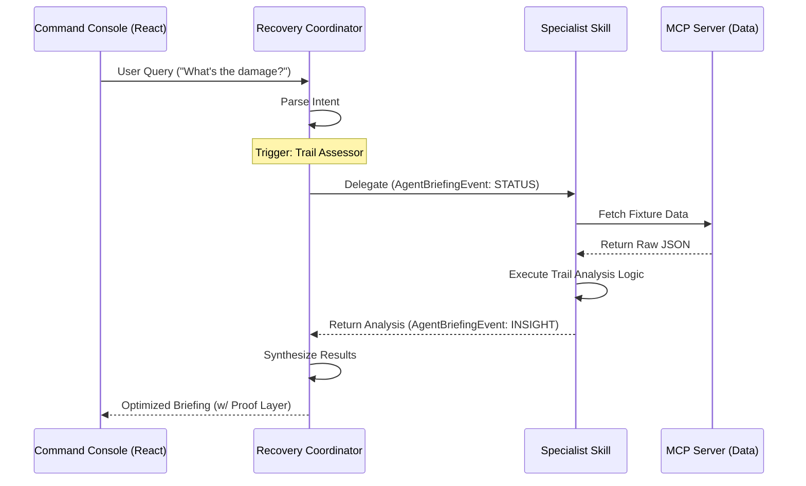

# Protocol: Agent Communication (v1.0)

> [!IMPORTANT]
> **Standard:** This protocol is aligned with **[ADR-005: Skills-First Architecture](../adr/ADR-005-skills-first-architecture.md)** and supersedes all legacy internal messaging drafts.

## 1. Overview
RANGER agents communicate with the **Command Console UI** and each other via structured events. The primary unit of communication is the `AgentBriefingEvent`, designed for real-time streaming, UI reactivity, and the transparent **Proof Layer**.

## 2. Event Schema: AgentBriefingEvent

The following JSON schema defines the mandatory fields for any event destined for the UI.

```json
{
  "$schema": "http://json-schema.org/draft-07/schema#",
  "title": "AgentBriefingEvent",
  "type": "object",
  "required": ["event_id", "correlation_id", "type", "source_agent", "content"],
  "properties": {
    "event_id": { "type": "string", "description": "UUID for this specific event." },
    "correlation_id": { "type": "string", "description": "Session/Incident ID to group related insights." },
    "parent_event_id": { "type": ["string", "null"], "description": "ID of the event that triggered this delegation." },
    "type": { "enum": ["INSIGHT", "ALERT", "ACTION", "STATUS"], "description": "Determines UI rendering priority." },
    "source_agent": { "type": "string", "description": "The Agent (Coordinator or Specialist) emitting the event." },
    "skill_id": { "type": "string", "description": "The specific Skill package (from the Skills Library) that performed the logic." },
    "content": {
      "type": "object",
      "required": ["summary"],
      "properties": {
        "summary": { "type": "string", "description": "One-line summary for toast/header." },
        "detail": { "type": "string", "description": "Main body text (Markdown supported)." }
      }
    },
    "proof_layer": {
      "type": "object",
      "properties": {
        "confidence": { "type": "number", "minimum": 0, "maximum": 1 },
        "reasoning_chain": { 
          "type": "array", 
          "items": { "type": "string" },
          "description": "Step-by-step logic trail."
        },
        "citations": {
          "type": "array",
          "items": {
            "type": "object",
            "properties": {
              "source": { "type": "string", "description": "e.g., 'Sentinel-2'" },
              "reference_id": { "type": "string" },
              "snippet": { "type": "string" }
            }
          }
        }
      }
    }
  }
}
```

## 3. Communication Lifecycle



## 4. State Transitions

| State | Agent Action | UI Behavior |
|-------|--------------|-------------|
| **PENDING** | Event queued | Skeleton loader in Insight Panel |
| **PROCESSING** | Tool/Skill executing | Pulsing lifecycle rail segment |
| **SUCCESS** | `INSIGHT` event emitted | Panel injection + Sound notification |
| **FAILED** | `ERROR` / `status_code 500` | Redirect to diagnostic modal |

## 5. Correlation Propagation
The `correlation_id` must persist throughout an entire multi-agent thread. This allows the UI to render the "Mirror of the Mind" — a unified view of how one insight (e.g., high burn severity) triggered subsequent actions (e.g., soil stability assessment).

---
*Created: December 2025*
